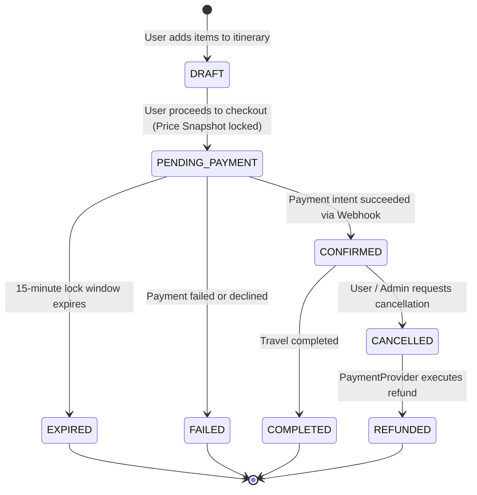
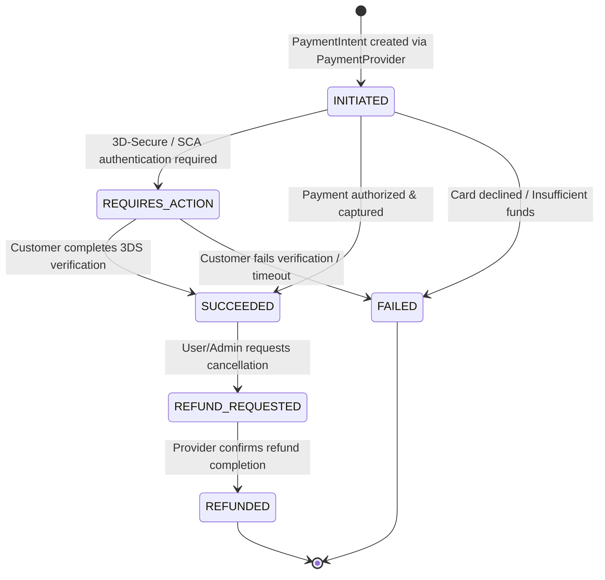
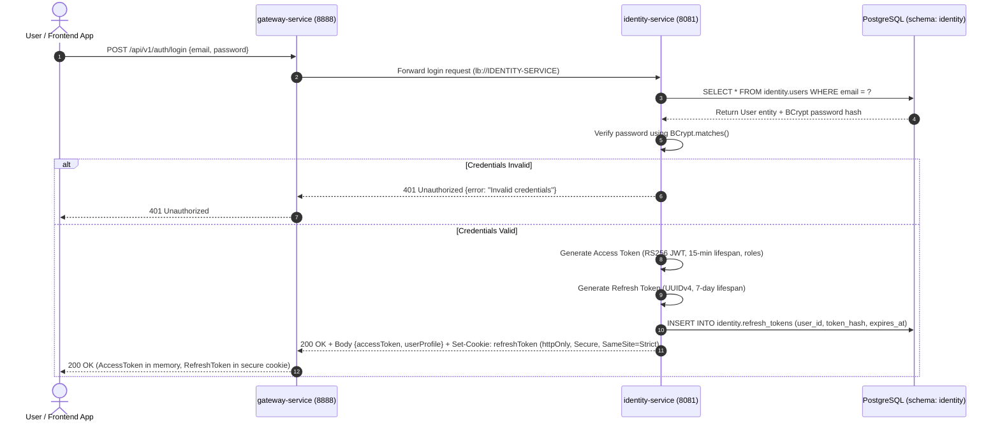
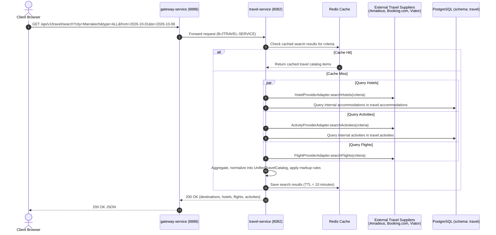
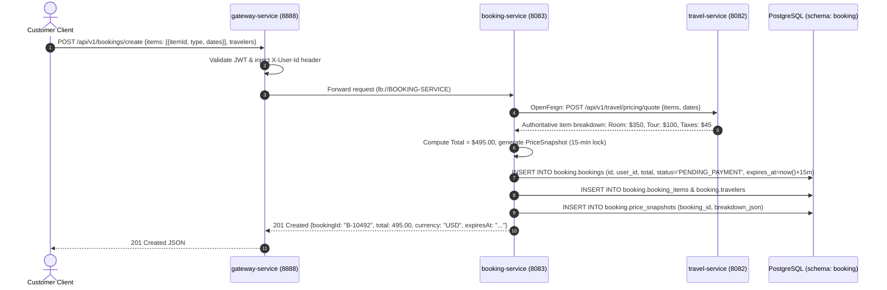
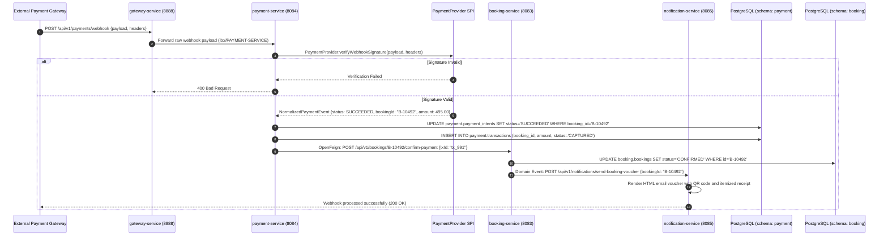
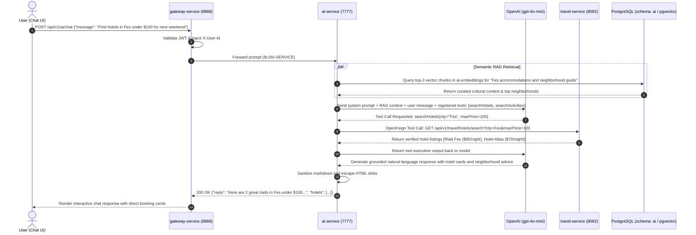
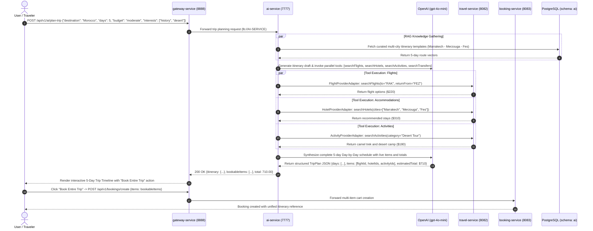

# Yuding V2 — Technical Architecture Specification

**Date:** September 19, 2026  
**Status:** Approved Architecture Baseline (Phase 5)  
**Target Branch:** `develop-v2`  
**Supersedes:** Yuding V1 Monolithic/Prototype Microservice Architecture  

---

## 1. Executive Summary & Architectural Blueprint

Yuding V2 is an enterprise-grade, cloud-native travel booking and intelligent exploration platform. Evolving from the prototype architecture of V1, V2 adopts a hardened, modular microservices architecture built on **Spring Boot 3.4.x**, **Spring Cloud 2024.x**, a single **PostgreSQL 16** cluster with **pgvector**, and a modern **Next.js (React 19 + TypeScript)** frontend.

### 1.1 High-Level Architectural Layers

```text
Next.js + React + TypeScript Frontend
        ↓
Reverse Proxy / HTTPS
        ↓
API Gateway
        ↓
────────────────────────────
Identity
Travel
Booking
Payment
AI
Notification
────────────────────────────
        ↓
PostgreSQL + pgvector
        ↓
External Providers / APIs
```

---

## 2. Core Architectural Decisions & System Tenets

1. **One PostgreSQL Cluster with 8 Dedicated Logical Schemas:**  
   Yuding V2 operates on a **single consolidated PostgreSQL 16 cluster** partitioned into 8 isolated logical schemas:
   - `identity` — Users, credentials, roles, permissions, refresh tokens.
   - `travel` — Destinations, hotels, room tiers, activities, transport catalog, supplier cache.
   - `booking` — Bookings, booking items, travelers, status history, authoritative price snapshots.
   - `payment` — Payment intents, ledger transactions, refund records, idempotency keys.
   - `notification` — Notification queue, dispatch logs, delivery templates.
   - `engagement` — User reviews, ratings, comments, likes, saved itineraries.
   - `ai` — Document chunks, vector embeddings (`pgvector`), chat sessions, tool execution logs.
   - `audit` — Cross-cutting security events, login attempts, administrative changes.  
   **Strict Schema Ownership Rule:** Each microservice strictly owns its assigned schema. No service is permitted to read or write another service's tables directly. All cross-domain data access must occur via REST/Feign APIs or asynchronous events.

2. **Provider-Neutral `PaymentProvider` Abstraction:**  
   The payment architecture is completely decoupled from any specific payment gateway. A vendor-neutral `PaymentProvider` interface handles payment intent creation, token validation, webhook verification, and refunds. Specific Payment Service Providers (such as Stripe, PayPal, local payment gateways, or mock sandbox providers) are implemented as pluggable adapters. Changes to the underlying payment provider do not affect booking or domain logic.

3. **Implementation-Neutral Asynchronous Event Transport:**  
   Asynchronous event and notification dispatching is designed around an abstract event publisher/consumer interface (domain events). The architecture avoids hardcoding specific message brokers (such as Kafka or RabbitMQ) during this phase. Event transport remains implementation-neutral (adaptable to in-memory events, transactional outbox tables, or external message brokers when required).

4. **Retain Eureka for Service Discovery:**  
   `discovery-service` (Spring Cloud Netflix Eureka Server) is maintained as the platform service registry. All microservices register dynamically, enabling client-side load balancing (`Spring Cloud LoadBalancer`) and dynamic Gateway route resolution (`lb://SERVICE-NAME`).

5. **Retain Spring Cloud Config for Centralized Configuration:**  
   `config-service` (Spring Cloud Config Server) provides externalized configuration management across environments (`dev`, `stage`, `prod`). The broken V1 submodule gitlink is permanently replaced by a clean native file repository or internal configuration store.

6. **Consolidate Travel Domain into `travel-service` via Provider Adapters:**  
   Flights, Hotels, Activities, Transfers, and Destinations are unified into a single domain service (**`travel-service`**). **No separate `hotel-service`, `flight-service`, `activity-service`, or `taxi-service` are created.** External travel APIs (Amadeus, Booking.com, Viator, local transfer dispatchers) are abstracted behind clean Provider Adapters.

7. **Dedicated `identity-service` Replaces Legacy Auth:**  
   The insecure V1 user/admin authentication controllers are permanently superseded by `identity-service`. All authentication is stateless (JWT access tokens + secure httpOnly refresh tokens) with BCrypt password hashing (work factor 12).

8. **Admin Functionality is Role-Protected (No Separate Admin Service):**  
   Admin access is managed through Role-Based Access Control (`ROLE_ADMIN`, `ROLE_SUPPORT`, `ROLE_USER`) embedded directly within domain services and enforced at both Gateway and Controller layers.

9. **Dedicated `booking-service` Owns Booking Lifecycle & Authoritative Pricing:**  
   `booking-service` owns the complete reservation state machine ($\text{DRAFT} \rightarrow \text{PENDING\_PAYMENT} \rightarrow \text{CONFIRMED} \rightarrow \text{COMPLETED} / \text{CANCELLED}$). It authoritatively calculates pricing on the server, eliminating V1's client-side calculation flaws.

10. **`ai-service` Owns Conversational AI, Tool Calling & RAG:**  
    Powered by OpenAI and Spring AI, `ai-service` provides an intelligent travel concierge and Smart Trip Planner. The model dynamically calls registered backend tools (`searchHotels`, `searchFlights`, `searchActivities`) and performs semantic searches over curated destination guides using `pgvector`.

---

## 3. Final Microservices Inventory & Responsibilities

| Service Name | Port | Database / Schema | Primary Framework | Core Responsibilities |
|---|---|---|---|---|
| **`gateway-service`** | `8888` | Redis (cache & limits) | Spring Cloud Gateway (Reactive) | Unified ingress, SSL termination, CORS, JWT perimeter validation, dynamic Eureka `lb://` routing, token-bucket rate limiting. |
| **`identity-service`** | `8081` | PostgreSQL (`identity`) | Spring Boot 3, Spring Security 6 | User registration, authentication, RS256 JWT issuance/validation, rotating refresh tokens, profile management, RBAC (`ROLE_USER`, `ROLE_ADMIN`, `ROLE_SUPPORT`). |
| **`travel-service`** | `8082` | PostgreSQL (`travel`, `engagement`), Redis | Spring Boot 3, Spring Data JPA | Unified catalog for Flights, Hotels, Activities, Transfers, and Destinations via Provider Adapters; customer reviews and ratings; Redis search cache. |
| **`booking-service`** | `8083` | PostgreSQL (`booking`) | Spring Boot 3, Spring Data JPA | Booking lifecycle state machine, server-authoritative dynamic pricing snapshots, multi-item itinerary cart, distributed Saga orchestration. |
| **`payment-service`** | `8084` | PostgreSQL (`payment`) | Spring Boot 3, Spring Data JPA | Payment orchestration via `PaymentProvider` abstraction, idempotency protection, payment intent lifecycle, webhook signature verification, refunds, PCI-DSS compliance. |
| **`notification-service`** | `8085` | PostgreSQL (`notification`) | Spring Boot 3, JavaMail, SendGrid | Asynchronous event consumer, responsive HTML email rendering (vouchers with QR codes, itemized invoices, password resets), multi-channel notification dispatch. |
| **`ai-service`** | `7777` | PostgreSQL (`ai` with `pgvector`) | Spring AI, Spring Boot 3 | Conversational travel assistant, Smart Trip Planner, LLM function tool calling, document embedding ingestion, semantic vector similarity retrieval. |
| **`discovery-service`** | `8761` | In-Memory Registry | Spring Cloud Netflix Eureka | Dynamic service registration, instance heartbeat monitoring, client-side load balancing, instance deregistration. |
| **`config-service`** | `9091` | Native / Internal Git Repository | Spring Cloud Config Server | Centralized externalized configuration management, environment profiles (`dev`, `stage`, `prod`), credential encryption. |

---

## 4. System Topology & Infrastructure Architecture

```mermaid
flowchart TD
    Client["Client Devices / Browsers<br/>(Next.js 19 + React + TypeScript)"]
    
    subgraph Edge Layer
        Proxy["Reverse Proxy / SSL Termination<br/>(Nginx / Caddy / Cloudflare)"]
        Gateway["gateway-service<br/>Port 8888<br/>(Spring Cloud Gateway + Redis)"]
    end

    subgraph Service Discovery & Configuration
        Eureka["discovery-service<br/>Port 8761<br/>(Spring Cloud Netflix Eureka)"]
        Config["config-service<br/>Port 9091<br/>(Spring Cloud Config Server)"]
    end

    subgraph Core Domain Microservices
        Identity["identity-service<br/>Port 8081<br/>(Auth, Users, RBAC)"]
        Travel["travel-service<br/>Port 8082<br/>(Flights, Hotels, Activities, Transfers)"]
        Booking["booking-service<br/>Port 8083<br/>(Booking Lifecycle & Saga)"]
        Payment["payment-service<br/>Port 8084<br/>(PaymentProvider & Ledger)"]
        AI["ai-service<br/>Port 7777<br/>(Spring AI, Tools, RAG)"]
        Notification["notification-service<br/>Port 8085<br/>(Email, SMS & Templates)"]
    end

    subgraph Persistence Layer: Single PostgreSQL 16 Cluster + pgvector
        subgraph Logical Schemas
            S_Identity[("schema: identity")]
            S_Travel[("schema: travel")]
            S_Booking[("schema: booking")]
            S_Payment[("schema: payment")]
            S_Notification[("schema: notification")]
            S_Engagement[("schema: engagement")]
            S_AI[("schema: ai (pgvector)")]
            S_Audit[("schema: audit")]
        end
    end

    subgraph External Providers & APIs
        PaymentGateways["External Payment Providers<br/>(Stripe, PayPal, Local PSP)"]
        TravelSuppliers["External Travel Suppliers<br/>(Amadeus, Booking.com, Viator)"]
        LLMProvider["LLM & Embeddings Provider<br/>(OpenAI gpt-4o-mini)"]
        EmailGateway["Transactional Email Gateway<br/>(SendGrid / AWS SES / SMTP)"]
    end

    %% Client Ingress
    Client -->|HTTPS| Proxy
    Proxy -->|HTTP/2| Gateway

    %% Infrastructure Ingress
    Core Domain Microservices -.->|Register & Heartbeat| Eureka
    Core Domain Microservices -.->|Fetch Properties| Config
    Gateway -.->|Route Discovery| Eureka

    %% Gateway Routing
    Gateway -->|/api/v1/auth/**| Identity
    Gateway -->|/api/v1/travel/**| Travel
    Gateway -->|/api/v1/bookings/**| Booking
    Gateway -->|/api/v1/payments/**| Payment
    Gateway -->|/api/v1/ai/**| AI

    %% Inter-Service Feign Calls
    Booking -->|Feign: Validate Availability & Price| Travel
    Booking -->|Feign: Create Payment Intent| Payment
    Booking -->|Event: Booking Confirmed| Notification
    Payment -->|Event: Payment Succeeded| Booking
    AI -->|Tool Call: Search Travel Catalog| Travel
    AI -->|Tool Call: Query Booking Details| Booking

    %% Database Schema Ownership
    Identity --- S_Identity
    Identity --- S_Audit
    Travel --- S_Travel
    Travel --- S_Engagement
    Booking --- S_Booking
    Payment --- S_Payment
    Notification --- S_Notification
    AI --- S_AI

    %% External Provider Connections
    Payment -->|PaymentProvider SPI| PaymentGateways
    Travel -->|Provider Adapter SPI| TravelSuppliers
    AI -->|HTTPS| LLMProvider
    Notification -->|SMTP / API| EmailGateway
```

---

## 5. Inter-Service Communication & Call Matrix

### 5.1 Service-to-Service Interaction Matrix

| Caller Service | Callee Service | Communication Type | Protocol / Mechanism | Purpose | Failure / Resilience Strategy |
|---|---|---|---|---|---|
| `gateway-service` | All Domain Services | Synchronous | HTTP/2 / Reactive WebClient | Dynamic routing via Eureka `lb://` | CircuitBreaker (5s timeout), 2x Retry. |
| `booking-service` | `travel-service` | Synchronous | REST via OpenFeign | Validate product availability and lock authoritative prices. | CircuitBreaker fallback; return inventory unavailable error if timeout. |
| `booking-service` | `payment-service` | Synchronous | REST via OpenFeign | Initialize `PaymentIntent` via `PaymentProvider` abstraction. | Idempotent retry with unique `bookingId` key. |
| `payment-service` | `booking-service` | Synchronous / Event | REST / Internal Event | Update booking status to `CONFIRMED` on webhook success. | Exponential backoff retry on webhook processing. |
| `booking-service` | `notification-service` | Asynchronous | Domain Event Port | Request booking voucher and itemized receipt dispatch. | Non-blocking async dispatch with retry queue. |
| `ai-service` | `travel-service` | Synchronous | REST via OpenFeign | Dynamic tool call execution: search flights, hotels, activities. | 3s strict timeout; fallback to general travel advice. |
| `ai-service` | `booking-service` | Synchronous | REST via OpenFeign | Dynamic tool call execution: check booking status and itinerary. | Propagates `X-User-Id`; 3s strict timeout. |
| All Services | `discovery-service` | Synchronous | Eureka Client | Heartbeat lease renewal and fetch registry instance table. | Local cache survives temporary Eureka downtime. |
| All Services | `config-service` | Synchronous | HTTP Client | Retrieve environment configurations and secrets at startup. | Fail-fast with startup retries. |

---

## 6. Single PostgreSQL Cluster & 8 Logical Schemas Architecture

Yuding V2 replaces multiple uncoordinated databases with a **single managed PostgreSQL 16 cluster** hosting 8 distinct, strictly isolated logical schemas.

```
+----------------------------------------------------------------------------------------------------+
|                                    PostgreSQL 16 Cluster                                           |
|                                                                                                    |
|  +--------------------+  +--------------------+  +--------------------+  +-----------------------+ |
|  |  schema: identity  |  |   schema: travel   |  |  schema: booking   |  |    schema: payment    | |
|  | - users            |  | - destinations     |  | - bookings         |  | - payment_intents     | |
|  | - roles            |  | - accommodations   |  | - booking_items    |  | - transactions        | |
|  | - user_roles       |  | - room_types       |  | - travelers        |  | - refund_records      | |
|  | - refresh_tokens   |  | - activities       |  | - price_snapshots  |  | - idempotency_keys    | |
|  | - credentials      |  | - transports       |  | - status_history   |  | - payment_methods     | |
|  +--------------------+  +--------------------+  +--------------------+  +-----------------------+ |
|                                                                                                    |
|  +--------------------+  +--------------------+  +--------------------+  +-----------------------+ |
|  | schema: engagement |  |schema: notification|  | schema: ai (vector)|  |    schema: audit      | |
|  | - reviews          |  | - message_queue    |  | - document_chunks  |  | - security_logs       | |
|  | - ratings          |  | - dispatch_logs    |  | - embeddings (1536)|  | - login_attempts      | |
|  | - comments         |  | - templates        |  | - chat_sessions    |  | - access_audits       | |
|  | - wishlists        |  | - user_preferences |  | - tool_call_logs   |  | - config_changes      | |
|  +--------------------+  +--------------------+  +--------------------+  +-----------------------+ |
+----------------------------------------------------------------------------------------------------+
```

### 6.1 Schema Ownership Boundaries & Rules

| Schema Name | Owning Service | Allowed Readers/Writers | Core Tables | Boundary & Isolation Enforcement |
|---|---|---|---|---|
| `identity` | `identity-service` | `identity-service` only | `users`, `credentials`, `roles`, `user_roles`, `refresh_tokens` | Other services store only `user_id` (UUID); no cross-schema joins. |
| `travel` | `travel-service` | `travel-service` only | `destinations`, `accommodations`, `room_types`, `activities`, `transfers`, `provider_cache` | Catalog products referenced downstream via composite IDs (`item_type` + `item_id`). |
| `booking` | `booking-service` | `booking-service` only | `bookings`, `booking_items`, `travelers`, `price_snapshots`, `status_history` | Stores authoritative price snapshots and links to `user_id`. |
| `payment` | `payment-service` | `payment-service` only | `payment_intents`, `transactions`, `refund_records`, `idempotency_keys` | Isolated financial ledger; links to `booking_id`. |
| `notification`| `notification-service` | `notification-service` only | `message_queue`, `dispatch_logs`, `templates`, `user_preferences` | Append-only notification queue and delivery audit records. |
| `engagement` | `travel-service` | `travel-service` only | `reviews`, `ratings`, `comments`, `wishlists` | Customer reviews tied to travel catalog items and verified booking IDs. |
| `ai` | `ai-service` | `ai-service` only | `document_chunks`, `embeddings` (VECTOR 1536), `chat_sessions`, `tool_call_logs` | Dedicated vector schema with HNSW index for cosine distance similarity. |
| `audit` | Cross-cutting | Appended by domain services | `security_logs`, `login_attempts`, `access_audits` | Tamper-evident append-only log for compliance and security auditing. |

---

## 7. External Provider Boundaries & Abstraction Architecture

### 7.1 Provider-Neutral `PaymentProvider` Abstraction

The payment subsystem is designed around a vendor-neutral Service Provider Interface (SPI). The core booking and payment logic does **not** depend on Stripe or any specific gateway:

```
                            +-----------------------------------+
                            |          payment-service          |
                            |                                   |
                            |   +---------------------------+   |
                            |   |   Payment Core Domain     |   |
                            |   |   - PaymentIntent, Ledger |   |
                            |   |   - Refund, Idempotency   |   |
                            |   +-------------+-------------+   |
                            |                 |                 |
                            |       [PaymentProvider SPI]       |
                            |       +---------+---------+       |
                            +-------|---------|---------|-------+
                                    |         |         |
                                    v         v         v
                            +-----------+ +-------+ +-----------+
                            |  Stripe   | | PayPal| | Local PSP |
                            |  Adapter  | |Adapter| |  Adapter  |
                            +-----+-----+ +---+---+ +-----+-----+
                                  |           |           |
                                  v           v           v
                            [Stripe API]  [PayPal]   [Local Gateway]
```

#### `PaymentProvider` Interface Specification

```java
public interface PaymentProvider {
    /**
     * Creates a payment intent with the external gateway.
     * Returns a provider-neutral PaymentIntentResult containing client secrets/tokens.
     */
    PaymentIntentResult createPaymentIntent(PaymentIntentRequest request);

    /**
     * Verifies the cryptographic authenticity of an incoming webhook payload.
     */
    WebhookVerificationResult verifyWebhookSignature(String payload, Map<String, String> headers);

    /**
     * Extracts normalized transaction status from a verified webhook event.
     */
    NormalizedPaymentEvent parseWebhookEvent(String payload);

    /**
     * Executes a refund for a previously captured transaction.
     */
    RefundResult executeRefund(RefundRequest request);

    /**
     * Retrieves the real-time status of a transaction from the provider.
     */
    PaymentStatusResult getPaymentStatus(String providerTransactionId);
}
```

- **Pluggable Implementations:** `StripePaymentProviderAdapter`, `PayPalPaymentProviderAdapter`, `LocalPspProviderAdapter`, and `MockPaymentProviderAdapter` (for local development and integration testing).
- **Zero Cardholder Data:** The frontend utilizes client-side tokenization (e.g., Stripe Elements, PayPal Smart Buttons), transmitting only opaque payment method tokens to the backend.

### 7.2 Travel Provider Adapters in `travel-service`

External travel APIs are encapsulated behind dedicated adapter interfaces:
- **`FlightProviderAdapter`:** Live flight availability, fare classes, cabin quotes (e.g. Amadeus API, Skyscanner).
- **`HotelProviderAdapter`:** Real-time accommodation search, room tiers, cancellation policies (e.g. Booking.com RapidAPI, Hotelbeds).
- **`ActivityProviderAdapter`:** Guided tours, excursions, tickets, language availability (e.g. Viator API, TripAdvisor).
- **`TransferProviderAdapter`:** Airport transfers, private shuttles, city taxis, ONCF train connections.

### 7.3 Notification Provider Abstraction in `notification-service`

- **`EmailGatewayAdapter`:** Implementation-neutral interface for transactional emails. Concrete adapters include `SendGridEmailAdapter`, `AwsSesEmailAdapter`, and `SmtpEmailAdapter` (for local MailHog/dev testing).

---

## 8. Authoritative Pricing & State Machine Architecture

### 8.1 Authoritative Server-Side Pricing Flow

To permanently eliminate the V1 vulnerability where prices were calculated in browser JavaScript (`100 * days * persons`):
1. The client submits only desired item identifiers, booking dates, and passenger counts.
2. `booking-service` calls `travel-service` via OpenFeign to obtain **authoritative supplier rate cards and pricing rules**.
3. `booking-service` computes the base price, applies seasonal multipliers, calculates applicable taxes/fees, and stores an **immutable `PriceSnapshot`** inside `schema: booking`.
4. The authoritative snapshot total is locked for a 15-minute checkout window and forwarded directly to `payment-service`.

### 8.2 Booking State Machine



### 8.3 Payment State Machine



---

## 9. Comprehensive High-Level Request Flows (Mermaid Sequence Diagrams)

### 9.1 Register / Login Flow (Authentication & Token Issuance)



---

### 9.2 Travel Search Flow (Provider Adapter Fan-Out)



---

### 9.3 Booking Flow (Authoritative Pricing & Reservation Creation)



---

### 9.4 Payment Flow (`PaymentProvider` Abstraction & Client Tokenization)

```mermaid
sequenceDiagram
    autonumber
    actor User as Customer Client
    participant GW as gateway-service (8888)
    participant BS as booking-service (8083)
    participant PS as payment-service (8084)
    participant Prov as PaymentProvider SPI<br/>(e.g. Stripe / PayPal Adapter)
    participant GatewayAPI as External Payment Gateway
    participant DB as PostgreSQL (schema: payment)

    User->>GW: POST /api/v1/payments/create-intent {bookingId: "B-10492"}
    GW->>GW: Validate JWT & inject X-User-Id
    GW->>BS: Forward checkout initiation
    BS->>BS: Verify booking status == PENDING_PAYMENT and not expired
    
    BS->>PS: OpenFeign: POST /api/v1/payments/intents {bookingId, amount: 495.00, currency: "USD"}
    PS->>PS: Check idempotency key (bookingId + attempt)
    PS->>Prov: PaymentProvider.createPaymentIntent(request)
    Prov->>GatewayAPI: Create external payment transaction (amount=49500, currency=usd)
    GatewayAPI-->>Prov: Return gateway transaction {transactionId: "tx_991", clientSecret: "cs_token_88"}
    
    PS->>DB: INSERT INTO payment.payment_intents (booking_id, provider_tx_id, amount, status='INITIATED')
    PS-->>BS: Return PaymentDetails {clientSecret: "cs_token_88", provider: "STRIPE"}
    BS-->>GW-->>User: 200 OK {clientSecret: "cs_token_88"}

    %% Client Payment Submission
    User->>GatewayAPI: Submit payment credentials directly via client SDK (card data never touches Yuding)
    GatewayAPI-->>User: Payment authorized (or 3DS challenge completed)
```

---

### 9.5 Payment Webhook Flow (Asynchronous Confirmation & Notification)



---

### 9.6 AI Assistant Flow (Conversational Concierge & Tool Calling)



---

### 9.7 Smart Trip Planner Flow (Multi-Day Itinerary & One-Click Booking)



---

## 10. Legacy V1 to V2 Transition Mapping

| Legacy V1 Component | V2 Target Service | Transition & Refactoring Actions |
|---|---|---|
| `backend/discovery-service` | `discovery-service` | **Retained & Modernized:** Eureka Server is the central service registry for dynamic `lb://` routing. |
| `backend/config-service` | `config-service` | **Retained & Modernized:** Spring Cloud Config Server provides externalized properties without broken submodules. |
| `backend/gateway-service` | `gateway-service` | **Refactored:** Eureka `lb://` dynamic routing, perimeter JWT token validation, Redis rate limiting, CORS. |
| `backend/user-service` | `identity-service` | **Replaced:** Completely supersedes V1 user/admin controllers with Spring Security 6, RS256 JWT, BCrypt, and RBAC. |
| `backend/reservation-service` (Catalog) | `travel-service` | **Consolidated:** Flights, Hotels, Activities, Transfers, and Destinations consolidated via Provider Adapters. |
| `backend/reservation-service` (Bookings) | `booking-service` | **Refactored:** Reservation state machine, server-authoritative pricing, and Saga orchestration. |
| `backend/reservation-service` (Payments) | `payment-service` | **Replaced:** Raw card storage eliminated; replaced by provider-neutral `PaymentProvider` abstraction and Stripe tokenization. |
| `backend/commentaire-service` | `travel-service` (`schema: engagement`) | **Absorbed:** Customer reviews and ratings tied to travel catalog items and verified booking IDs. |
| `backend/ai-service` | `ai-service` | **Refactored:** Upgraded to Spring AI 1.0, OpenAI function tool calling, and `pgvector` RAG pipeline. |
| *None (New in V2)* | `notification-service` | **New Service:** Asynchronous transactional HTML email dispatch and vouchers. |
| `docker-compose.yml` (V1 MySQL) | `infra/docker-compose.yml` | **Replaced:** Single PostgreSQL 16 (`pgvector`) cluster with 8 logical schemas and Redis. |

---

## 11. Architectural Integrity Sign-Off

- **Single Database Cluster Confirmed:** All data resides in one PostgreSQL 16 cluster partitioned into 8 isolated schemas (`identity`, `travel`, `booking`, `payment`, `notification`, `engagement`, `ai`, `audit`). No service directly accesses another service's tables.
- **`PaymentProvider` Abstraction Confirmed:** Payment processing is implementation-neutral. Gateway providers can be swapped or added without modifying booking logic.
- **Neutral Event Transport Confirmed:** Domain events use abstract publisher/consumer interfaces without premature broker lock-in.
- **Consolidation Verified:** All travel catalog operations remain in `travel-service`. No separate hotel, flight, activity, or taxi microservices exist.
- **Zero Premature Implementation:** This phase is strictly documentation. No code or container modifications have been performed outside documentation files. The preserved frontend remains completely intact.
