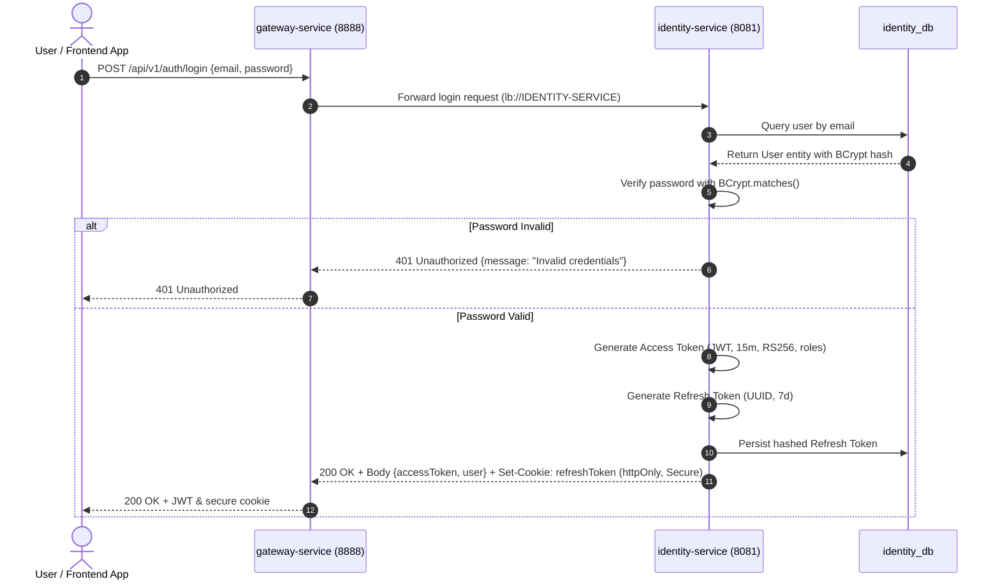
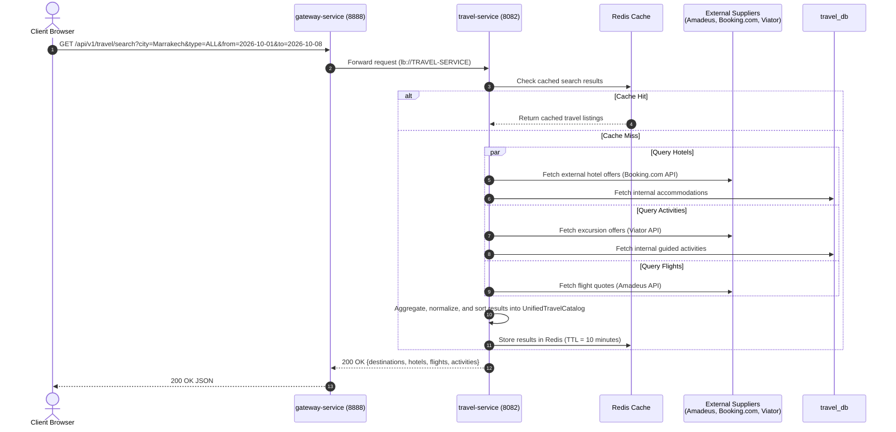
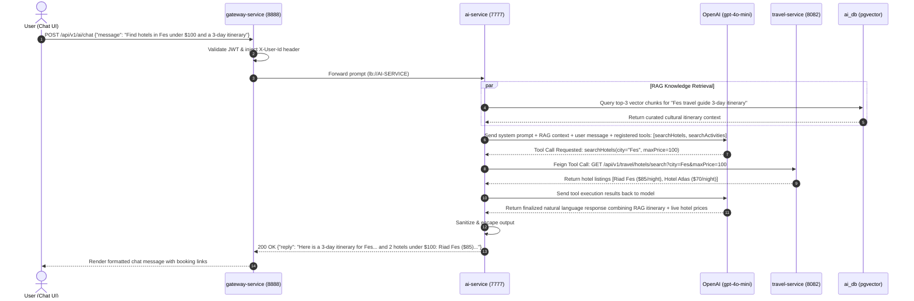

# Yuding V2 — Technical Architecture Specification

**Date:** September 19, 2026  
**Status:** Approved Architecture Baseline  
**Target Branch:** `develop-v2`  
**Supersedes:** Yuding V1 Monolithic/Prototype Microservice Architecture  

---

## 1. Executive Summary & Architectural Vision

Yuding V2 is an enterprise-grade, cloud-native travel booking and exploration platform. Transitioning from the prototype architecture of V1, V2 adopts a hardened, event-driven microservices architecture built on **Spring Boot 3.4.x**, **Spring Cloud 2024.x**, **PostgreSQL 16** with **pgvector**, and a unified **Next.js (React 19 + TypeScript)** frontend.

### 1.1 Core Architectural Decisions

1. **Retain Eureka for Service Discovery:**  
   `discovery-service` (Spring Cloud Netflix Eureka Server) is maintained as the central registry. All microservices register dynamically, enabling client-side load balancing (`Spring Cloud LoadBalancer`) and dynamic Gateway route resolution (`lb://SERVICE-NAME`).
2. **Retain Spring Cloud Config for Centralized Configuration:**  
   `config-service` (Spring Cloud Config Server) is maintained to provide externalized environment configurations (`dev`, `stage`, `prod`). The broken V1 gitlink submodule is replaced by a clean native file search location or internal configuration repository.
3. **Consolidate Travel Catalog into `travel-service` via Provider Adapters:**  
   Flights, Hotels, Activities, Transfers, and Destinations are unified into a single domain service (**`travel-service`**). **No separate `hotel-service`, `flight-service`, `activity-service`, or `taxi-service` are created.** Third-party suppliers (Amadeus, Booking.com, Viator, local transfer dispatchers) are abstracted behind clean Provider Adapters.
4. **Dedicated `identity-service` Replaces Legacy Auth:**  
   The legacy `userController` and `adminController` from V1 are permanently superseded by `identity-service`. All authentication is stateless (JWT access tokens + secure httpOnly refresh tokens) with BCrypt password hashing (strength 12).
5. **Admin Functionality is Role-Protected (No Separate Admin Service):**  
   Admin access is managed through Role-Based Access Control (`ROLE_ADMIN`, `ROLE_SUPPORT`, `ROLE_USER`) embedded in domain services and enforced at the Gateway and Controller layers.
6. **Dedicated `booking-service` Owns Booking Lifecycle:**  
   `booking-service` manages reservations state machine ($\text{DRAFT} \rightarrow \text{PENDING} \rightarrow \text{CONFIRMED} \rightarrow \text{COMPLETED} / \text{CANCELLED}$), server-authoritative dynamic pricing, and distributed Saga orchestration.
7. **Dedicated `payment-service` Owns Payment Orchestration:**  
   Full PCI-DSS Level 1 compliance through Stripe PSP tokenization, idempotent ledger tracking, refund execution, and cryptographic webhook verification. Zero raw cardholder data (PAN/CVV) enters Yuding servers.
8. **Dedicated `notification-service` Owns Communications:**  
   Asynchronous event consumption for transactional HTML emails (booking vouchers, payment receipts, password resets) and SMS alerts via SendGrid/SMTP.
9. **`ai-service` Owns Conversational AI, Tool Calling & RAG:**  
   Integrated with OpenAI `gpt-4o-mini`, supporting LLM function/tool calling against `travel-service` and `booking-service`, and semantic RAG retrieval powered by `pgvector`.
10. **Strict Database-per-Service Isolation:**  
    Consolidated PostgreSQL 16 server hosting dedicated, isolated databases (`identity_db`, `travel_db`, `booking_db`, `payment_db`, `notification_db`, `ai_db`). Cross-database joins and shared schemas are strictly prohibited.

---

## 2. Final Microservices Inventory

Yuding V2 consists of **9 core microservices**:

| Service Name | Port | Primary Framework | Persistence | Core Responsibility |
|---|---|---|---|---|
| **`gateway-service`** | `8888` | Spring Cloud Gateway (Reactive) | Redis (Rate limiting & sessions) | Unified ingress, SSL termination, CORS, JWT claims propagation, dynamic `lb://` routing. |
| **`identity-service`** | `8081` | Spring Boot 3, Spring Security 6 | PostgreSQL (`identity_db`) | User registration, authentication, JWT issuance & verification, profile management, RBAC (`ROLE_USER`, `ROLE_ADMIN`, `ROLE_SUPPORT`). |
| **`travel-service`** | `8082` | Spring Boot 3, Spring Data JPA | PostgreSQL (`travel_db`), Redis (Catalog cache) | Consolidated travel catalog (Flights, Hotels, Activities, Transfers, Destinations) via Provider Adapters. |
| **`booking-service`** | `8083` | Spring Boot 3, Spring Data JPA | PostgreSQL (`booking_db`) | Booking lifecycle, reservations state machine, server-authoritative pricing, Saga orchestration. |
| **`payment-service`** | `8084` | Spring Boot 3, Spring Data JPA | PostgreSQL (`payment_db`) | Payment orchestration, Stripe integration, idempotency, webhook processing, refund execution, PCI-DSS compliance. |
| **`notification-service`**| `8085` | Spring Boot 3, JavaMail, SendGrid | PostgreSQL (`notification_db`) | Transactional emails (confirmations, receipts, password resets, alerts), async event consumption. |
| **`ai-service`** | `7777` | Spring AI / Spring Boot 3 | PostgreSQL + `pgvector` (`ai_db`) | Conversational assistant, LLM function calling (tools), vector embeddings, destination RAG knowledge base. |
| **`discovery-service`**| `8761` | Spring Cloud Netflix Eureka | Memory | Service registry, instance heartbeat tracking, health monitoring, dynamic service discovery. |
| **`config-service`** | `9091` | Spring Cloud Config Server | Git / Native File Repository | Centralized externalized configuration management, environment profiles (`dev`, `stage`, `prod`), secret management. |

---

## 3. Detailed Service Responsibilities

### 3.1 `gateway-service` (Port: 8888) — The Intelligent Ingress
- **Unified API Gateway:** Sole public entrypoint for all frontend traffic (`http://localhost:8888` / `https://api.yuding.com`).
- **Dynamic Route Resolution:** Interacts with `discovery-service` (Eureka) to route incoming requests using `lb://` scheme (`lb://IDENTITY-SERVICE`, `lb://TRAVEL-SERVICE`, `lb://BOOKING-SERVICE`, etc.), enabling zero-downtime scaling.
- **Perimeter Security & JWT Validation:** Decodes and validates JWT access tokens, rejects expired/tampered tokens, extracts identity claims, and injects trusted internal headers (`X-User-Id`, `X-User-Email`, `X-User-Roles`).
- **CORS Centralization:** Enforces allowed origins, headers, and HTTP methods across all API routes.
- **Rate Limiting & DDoS Shield:** Redis-backed Token Bucket algorithm to protect downstream endpoints from credential stuffing and scraping.

### 3.2 `identity-service` (Port: 8081) — Authentication & Access Control
- **User & Admin Authentication:** Replaces legacy V1 `user-service`. Handles user sign-up, sign-in, and administrative credential verification.
- **Cryptographic Security:** High-entropy BCrypt password hashing (work factor 12). Generates RS256-signed JWT access tokens (15-minute validity) and rotating refresh tokens (7-day validity).
- **Role-Based Access Control (RBAC):** Manages user roles (`ROLE_USER`, `ROLE_ADMIN`, `ROLE_SUPPORT`) and associated domain permissions.
- **Account Governance:** Email verification, secure password reset flows, profile management, and account status toggles (`ACTIVE`, `SUSPENDED`).

### 3.3 `travel-service` (Port: 8082) — Unified Travel Catalog
- **Consolidated Catalog Domain:** Single authoritative owner of all travel items:
  - **Flights:** Flight offers, cabin classes, airline itineraries, baggage allowances.
  - **Hotels & Accommodations:** Hotels, riads, apartments, room tiers, amenities, availability windows.
  - **Activities:** Local excursions, cultural visits, tickets, scheduling, guide languages.
  - **Transfers:** Airport shuttles, private chauffeurs, city taxis, ONCF train connections.
  - **Destinations:** Destination guides, climate, travel tips, cultural highlights.
- **Provider Adapter Architecture:** Connects to external travel suppliers through clean adapter interfaces (`AmadeusFlightAdapter`, `BookingDotComAdapter`, `ViatorActivityAdapter`, `LocalTransferAdapter`, `InternalCatalogAdapter`).
- **Catalog Caching:** High-throughput caching of supplier search results in Redis (TTL: 5–15 min).
- **Admin Catalog Endpoints:** Role-protected (`ROLE_ADMIN`) REST endpoints for managing internal listings, base prices, and supplier configurations.

### 3.4 `booking-service` (Port: 8083) — Reservation Lifecycle & Saga
- **State Machine Management:** Governs the end-to-end reservation lifecycle:
  $$\text{DRAFT} \longrightarrow \text{PENDING\_PAYMENT} \longrightarrow \text{CONFIRMED} \longrightarrow \text{COMPLETED} \quad (\text{or } \text{CANCELLED} / \text{REFUNDED})$$
- **Authoritative Server Pricing:** Eliminates V1 client-side pricing flaws. Authoritatively computes totals including taxes, fees, and provider costs.
- **Multi-Item Itinerary Aggregator:** Supports combining flights, hotels, excursions, and transfers into a single unified booking reference.
- **Saga Orchestrator:** Coordinates temporary inventory locks with `travel-service`, payment intent creation with `payment-service`, and confirmation dispatch with `notification-service`.
- **Customer & Admin Booking APIs:** Endpoints for users to view bookings and for admins/support to review platform-wide reservations.

### 3.5 `payment-service` (Port: 8084) — PCI-DSS Payment Orchestrator
- **Stripe PSP Integration:** Creates and tracks Stripe `PaymentIntent` and `CheckoutSession` objects.
- **Zero Cardholder Data Exposure:** Operates with Stripe Elements on the frontend. No raw credit card PAN or CVV touches backend memory or database.
- **Webhook Processing:** Cryptographically validates Stripe webhooks (`payment_intent.succeeded`, `charge.refunded`) to trigger idempotent order confirmation.
- **Double-Charge Protection:** Enforces unique idempotency keys per transaction attempt.
- **Ledger & Refunds:** Maintains an immutable transaction audit log and orchestrates partial or full refunds.

### 3.6 `notification-service` (Port: 8085) — Asynchronous Communications
- **Domain Event Consumer:** Listens for platform events (`BookingConfirmedEvent`, `PaymentFailedEvent`, `UserRegisteredEvent`, `BookingCancelledEvent`).
- **Responsive Email Engine:** Renders HTML emails using Thymeleaf templates (booking vouchers with QR codes, itemized payment invoices, password reset links).
- **Provider Multi-Tenancy:** Abstraction over SendGrid API and SMTP relay with automated retries and dead-letter handling.

### 3.7 `ai-service` (Port: 7777) — Travel Concierge, Tools & RAG
- **Intelligent Assistant:** Spring AI integration powered by OpenAI `gpt-4o-mini`.
- **Dynamic Tool Calling (Function Calling):** LLM dynamically invokes registered backend tools:
  - `searchAccommodations(location, checkIn, checkOut, maxPrice)`
  - `searchFlights(origin, destination, departureDate)`
  - `searchActivities(city, category, date)`
  - `checkBookingStatus(bookingReference)`
- **Retrieval-Augmented Generation (RAG):**
  - Uses `pgvector` in PostgreSQL for vector embeddings of travel guides, itineraries, and cultural advisories.
  - Queries top-$k$ semantic chunks to ground assistant responses and eliminate hallucinations.
- **Security & XSS Prevention:** Strict prompt engineering, topic whitelisting, and output sanitization.

### 3.8 `discovery-service` (Port: 8761) — Service Registry
- **Eureka Server Role:** Central directory where all microservices register their host, port, and health check URLs (`/actuator/health`).
- **Client-Side Load Balancing:** Services resolve logical names (`http://TRAVEL-SERVICE`) via Spring Cloud LoadBalancer without hardcoded IP addresses.
- **Failure Detection:** Automatically evicts crashed or unhealthy service instances based on heartbeat lease renewals.

### 3.9 `config-service` (Port: 9091) — Centralized Configuration
- **Spring Cloud Config Role:** Serves externalized configuration properties to all microservices at startup.
- **Environment Profiles:** Supplies environment-specific configurations (`dev`, `stage`, `prod`).
- **Clean Architecture:** Operates with native file search locations or internal Git repositories, eliminating the V1 broken submodule gitlink.
- **Secret Encryption:** Encrypts sensitive credentials (database passwords, Stripe keys, OpenAI keys) using symmetric or RSA keys.

---

## 4. V1 to V2 Service Transition & Migration Matrix

The following table details how every component from Yuding V1 transitions into the final V2 architecture:

| Legacy V1 Component | V1 Port / Path | V2 Decision | V2 Target Service | Transition & Architectural Rationale |
|---|---|---|---|---|
| `discovery-service` | `8761` | **KEPT & RECONNECTED** | `discovery-service` | Eureka Server is retained as the standard service registry for Spring Cloud. |
| `config-service` | `9091` | **KEPT & RECONNECTED** | `config-service` | Spring Cloud Config Server is retained; configuration source moved to clean native/internal repo. |
| `config-repo` (submodule) | `backend/config-repo` | **REPLACED** | `config-service` internal repo | Broken Git submodule (mode 160000) permanently eliminated. |
| `gateway-service` | `8888` | **REFACTORED** | `gateway-service` | Restored Eureka `lb://` routing, added perimeter JWT validation, Redis rate limiting, and CORS. |
| `user-service` | `8081` | **REPLACED** | `identity-service` | Plaintext passwords, insecure search endpoints, and duplicated admin models replaced by Spring Security 6 + JWT + RBAC. |
| `reservation-service` (Catalog) | `8090` | **EXTRACTED & CONSOLIDATED** | `travel-service` | Accommodations, activities, and transports extracted from the booking monolith into unified catalog. |
| `reservation-service` (Bookings) | `8090` | **REFACTORED** | `booking-service` | Booking lifecycle, state machine, dynamic pricing, and Saga orchestration separated into dedicated service. |
| `reservation-service` (Payments) | `8090` | **REPLACED** | `payment-service` | Insecure card storage (`numcarte`, `cvv`) replaced by PCI-DSS compliant Stripe integration. |
| `commentaire-service` | `8072` | **ABSORBED** | `travel-service` & `booking-service` | Review entities linked directly to verified travel catalog items and verified customer bookings. |
| `ai-service` | `7777` | **REFACTORED** | `ai-service` | Upgraded to Spring AI 1.0, added dynamic tool calling against travel/booking APIs, and pgvector RAG. |
| *None (New in V2)* | `8085` | **NEW SERVICE** | `notification-service` | Dedicated service for asynchronous email, SMS, and voucher delivery. |
| `docker-compose.yml` (V1 MySQL) | Root | **REPLACED** | `infra/docker-compose.yml` | MySQL 8 with blank passwords and phpMyAdmin replaced by PostgreSQL 16 (`pgvector`) and Redis. |

---

## 5. Architectural Topology & Dependency Map

### 5.1 System Topology Diagram

```mermaid
flowchart TD
    Client["Client Browsers / Mobile App<br/>(Next.js 19 Frontend)"]
    
    subgraph Edge Layer
        Gateway["gateway-service<br/>Port 8888<br/>(Spring Cloud Gateway + Redis)"]
    end

    subgraph Service Discovery & Configuration
        Eureka["discovery-service<br/>Port 8761<br/>(Netflix Eureka)"]
        Config["config-service<br/>Port 9091<br/>(Spring Cloud Config)"]
    end

    subgraph Core Domain Services
        Identity["identity-service<br/>Port 8081<br/>(Auth, Users, RBAC)"]
        Travel["travel-service<br/>Port 8082<br/>(Flights, Hotels, Activities, Transfers)"]
        Booking["booking-service<br/>Port 8083<br/>(Booking Lifecycle & Saga)"]
        Payment["payment-service<br/>Port 8084<br/>(Stripe & Idempotent Ledger)"]
        Notification["notification-service<br/>Port 8085<br/>(Email, SMS & Templates)"]
        AI["ai-service<br/>Port 7777<br/>(Spring AI, Tools, RAG)"]
    end

    subgraph Persistence Layer (PostgreSQL 16)
        DB_Identity[("identity_db")]
        DB_Travel[("travel_db")]
        DB_Booking[("booking_db")]
        DB_Payment[("payment_db")]
        DB_Notification[("notification_db")]
        DB_Vector[("ai_vector_db<br/>(pgvector)")]
    end

    subgraph External Providers & Third-Party APIs
        StripeAPI["Stripe Payments API<br/>(PCI-DSS Compliant)"]
        TravelSuppliers["External Travel Suppliers<br/>(Amadeus, Booking.com, Viator)"]
        OpenAIAPI["OpenAI API<br/>(gpt-4o-mini / Embeddings)"]
        EmailProvider["Email Gateway<br/>(SendGrid / AWS SES)"]
    end

    %% Ingress
    Client -->|HTTPS / REST| Gateway

    %% Discovery & Config
    Core Domain Services -.->|Register & Heartbeat| Eureka
    Core Domain Services -.->|Fetch Configuration| Config
    Gateway -.->|Route Discovery| Eureka

    %% Gateway Routing
    Gateway -->|/api/v1/auth/**| Identity
    Gateway -->|/api/v1/travel/**| Travel
    Gateway -->|/api/v1/bookings/**| Booking
    Gateway -->|/api/v1/payments/**| Payment
    Gateway -->|/api/v1/ai/**| AI

    %% Inter-Service Feign Calls
    Booking -->|Feign: Validate Catalog & Price| Travel
    Booking -->|Feign: Create PaymentIntent| Payment
    Booking -->|Async Event: Booking Confirmed| Notification
    Payment -->|Async Event: Payment Succeeded| Booking
    AI -->|Tool Call: Search Travel| Travel
    AI -->|Tool Call: Lookup Booking| Booking

    %% Database Ownership
    Identity --- DB_Identity
    Travel --- DB_Travel
    Booking --- DB_Booking
    Payment --- DB_Payment
    Notification --- DB_Notification
    AI --- DB_Vector

    %% External APIs
    Payment -->|HTTPS| StripeAPI
    Travel -->|HTTPS / Adapters| TravelSuppliers
    AI -->|HTTPS| OpenAIAPI
    Notification -->|SMTP / API| EmailProvider
```

### 5.2 Inter-Service Communication Matrix ("Which Services Call Which")

| Caller Service | Callee Service | Protocol / Client | Call Nature | Purpose | Failure / Resilience Strategy |
|---|---|---|---|---|---|
| `gateway-service` | All Domain Services | HTTP/2 (Reactive) | Synchronous | Ingress routing via Eureka `lb://` | CircuitBreaker (5s timeout), 2x Retry. |
| `booking-service` | `travel-service` | REST via OpenFeign | Synchronous | Validate item availability and lock authoritative pricing. | CircuitBreaker fallback; return inventory unavailable error if timeout. |
| `booking-service` | `payment-service` | REST via OpenFeign | Synchronous | Create Stripe `PaymentIntent` and request client secret. | Idempotent retry with unique `bookingId` key. |
| `booking-service` | `notification-service` | Event / REST | Asynchronous | Dispatch booking vouchers and confirmation emails. | Non-blocking fire-and-forget; persistent retry queue. |
| `payment-service` | `booking-service` | REST / Internal Event | Synchronous | Confirm booking upon Stripe webhook verification. | Retry with exponential backoff on webhook delivery. |
| `ai-service` | `travel-service` | REST via OpenFeign | Synchronous | Execute LLM tool calls (`searchHotels`, `searchFlights`). | 3s strict timeout; fallback to general guidance. |
| `ai-service` | `booking-service` | REST via OpenFeign | Synchronous | Execute LLM tool call (`checkBookingStatus`). | Propagates `X-User-Id`; 3s strict timeout. |
| All Services | `discovery-service` | Eureka Client | Heartbeat | Register hostname/port and fetch service instance table. | Local instance cache; survives temporary Eureka outages. |
| All Services | `config-service` | HTTP Client | Startup Fetch | Retrieve environment configurations and secrets. | Fail-fast on initial bootstrap with configurable retries. |

---

## 6. External Provider Boundaries & The Provider Adapter Pattern

To safeguard the internal architecture against external schema breaking changes and supplier rate limits, `travel-service` abstracts suppliers through the **Provider Adapter Pattern**:

```
                         +----------------------------------------+
                         |             travel-service             |
                         |                                        |
                         |   +--------------------------------+   |
                         |   |       Core Travel Domain       |   |
                         |   |  - FlightOffer, HotelListing   |   |
                         |   |  - Activity, Transfer          |   |
                         |   +---------------+----------------+   |
                         |                   |                    |
                         |      [Provider Adapter SPI]            |
                         |      +------------+------------+       |
                         +------|------------|------------|-------+
                                |            |            |
                                v            v            v
                         +------------+ +------------+ +------------+
                         |  Amadeus   | | Booking.com| |  Internal  |
                         |  Adapter   | |  Adapter   | |  Catalog   |
                         +-----+------+ +-----+------+ +-----+------+
                               |              |              |
                               v              v              v
                         [Amadeus API] [Booking API]   [travel_db]
```

### 6.1 Provider Adapters in `travel-service`
1. **Flights (`FlightProviderAdapter`):**
   - Implementations: `AmadeusFlightAdapter` (live flight search, cabin selection, pricing) and `MockFlightAdapter` (offline testing).
2. **Hotels & Accommodations (`HotelProviderAdapter`):**
   - Implementations: `BookingDotComAdapter` (live hotel inventory) and `InternalAccommodationAdapter` (local riads/hotels stored in `travel_db`).
3. **Activities & Tours (`ActivityProviderAdapter`):**
   - Implementations: `ViatorActivityAdapter` (commercial excursions) and `InternalActivityAdapter` (curated local cultural experiences).
4. **Transfers & Transport (`TransferProviderAdapter`):**
   - Implementations: `LocalTransferAdapter` (private airport shuttles, city taxis) and `OncfTrainAdapter` (Morocco high-speed rail schedules).

### 6.2 Provider Adapters in `payment-service`
- **`StripePaymentAdapter`:** Interacts with Stripe REST API. Ingests card payments via client-side Stripe Elements tokens and handles webhook signatures (`stripe-signature` header). Zero card numbers stored internally.

### 6.3 Provider Adapters in `notification-service`
- **`SendGridEmailAdapter` / `SmtpEmailAdapter`:** Dispatches transactional HTML emails and handles bounces and delivery receipts.

### 6.4 Provider Adapters in `ai-service`
- **`OpenAiChatAdapter`:** Interacts with OpenAI API (`gpt-4o-mini`, `text-embedding-3-small`). Executes dynamic tool call orchestration.

---

## 7. Database Ownership & Data Boundary Architecture

Yuding V2 enforces strict **Database-per-Service** isolation on a managed **PostgreSQL 16** cluster. Each database is exclusively owned and accessed by its corresponding microservice:

```
+----------------------------------------------------------------------------------------------------+
|                                    PostgreSQL 16 Cluster                                           |
|                                                                                                    |
|  +--------------------+  +--------------------+  +--------------------+  +-----------------------+ |
|  |    identity_db     |  |     travel_db      |  |     booking_db     |  |      payment_db       | |
|  | - users            |  | - destinations     |  | - bookings         |  | - transactions        | |
|  | - roles            |  | - accommodations   |  | - booking_items    |  | - payment_intents     | |
|  | - refresh_tokens   |  | - activities       |  | - travelers        |  | - refund_records      | |
|  | - audit_logs       |  | - transports       |  | - status_history   |  | - payment_methods     | |
|  |                    |  | - reviews          |  |                    |  |                       | |
|  +--------------------+  +--------------------+  +--------------------+  +-----------------------+ |
|                                                                                                    |
|  +--------------------+  +-----------------------------------------------------------------------+ |
|  |  notification_db   |  |                              ai_db                                    | |
|  | - message_logs     |  | - vector_store (pgvector HNSW extension)                              | |
|  | - email_templates  |  | - destination_embeddings, document_chunks                             | |
|  | - delivery_status  |  | - chat_conversations, chat_messages                                   | |
|  +--------------------+  +-----------------------------------------------------------------------+ |
+----------------------------------------------------------------------------------------------------+
```

### 7.1 Schema Ownership Boundaries

| Database | Owning Service | Allowed Read/Write | Core Entities | Primary Isolation Rule |
|---|---|---|---|---|
| `identity_db` | `identity-service` | `identity-service` only | `users`, `roles`, `user_roles`, `refresh_tokens`, `login_audit` | Other services store only `user_id` (UUID); no foreign keys to `identity_db`. |
| `travel_db` | `travel-service` | `travel-service` only | `destinations`, `accommodations`, `room_types`, `activities`, `transfers`, `reviews`, `catalog_cache` | Catalog items referenced downstream by composite IDs (`item_type` + `item_id`). |
| `booking_db` | `booking-service` | `booking-service` only | `bookings`, `booking_items`, `travelers`, `booking_status_log` | Booking records link to `user_id` and item IDs without cross-database constraints. |
| `payment_db` | `payment-service` | `payment-service` only | `payments`, `payment_intents`, `refunds`, `idempotency_keys` | Financial ledger is strictly isolated; links to `booking_id`. |
| `notification_db`| `notification-service` | `notification-service` only | `notification_queue`, `dispatch_logs`, `templates` | Append-only notification logs. |
| `ai_db` | `ai-service` | `ai-service` only | `document_chunks`, `embeddings` (VECTOR 1536), `chat_sessions`, `chat_history` | Embeddings and chat sessions isolated to AI operations. |

---

## 8. High-Level Request Flows

### 8.1 User Authentication Flow (Login & Token Issuance)



---

### 8.2 Unified Travel Search Flow (Provider Adapter Fan-Out)



---

### 8.3 Booking Creation & Payment Orchestration Flow (Saga Pattern)

```mermaid
sequenceDiagram
    autonumber
    actor User as Customer Client
    participant GW as gateway-service (8888)
    participant BS as booking-service (8083)
    participant TS as travel-service (8082)
    participant PS as payment-service (8084)
    participant Stripe as Stripe PSP
    participant NS as notification-service (8085)

    %% Step 1: Draft & Price Confirmation
    User->>GW: POST /api/v1/bookings/create {items: [{itemId, type, dates}], travelerInfo}
    GW->>GW: Validate JWT & inject X-User-Id header
    GW->>BS: Forward booking request (lb://BOOKING-SERVICE)
    BS->>TS: Feign: Validate availability & calculate authoritative price
    TS-->>BS: Price confirmed: $450.00
    BS->>BS: Create Booking record in booking_db (Status: PENDING_PAYMENT)
    
    %% Step 2: Payment Intent Creation
    BS->>PS: Feign: POST /api/v1/payments/intents {bookingId, amount: 450.00, currency: "USD"}
    PS->>Stripe: Create PaymentIntent (amount=45000, currency=usd, metadata={bookingId})
    Stripe-->>PS: Return PaymentIntent {id: "pi_123", client_secret: "cs_xyz"}
    PS->>PS: Record intent in payment_db (Status: REQUIRES_PAYMENT_METHOD)
    PS-->>BS: Return PaymentDetails {clientSecret: "cs_xyz"}
    BS-->>GW-->>User: 201 Created {bookingId: "B-998", clientSecret: "cs_xyz"}

    %% Step 3: Frontend Client Payment Submission
    User->>Stripe: Confirm payment via Stripe.js (card details submitted directly to Stripe)
    Stripe-->>User: Payment authorized successfully

    %% Step 4: Webhook Ingestion & Confirmation
    Stripe->>GW: POST /api/v1/payments/webhook (Signature: t=..., v1=...)
    GW->>PS: Forward verified webhook
    PS->>PS: Verify Stripe cryptographic signature
    PS->>PS: Update payment status to SUCCEEDED (idempotent)
    PS->>BS: POST /api/v1/bookings/B-998/confirm-payment {paymentId: "pi_123"}
    BS->>BS: Update Booking status to CONFIRMED
    
    %% Step 5: Notification Dispatch
    BS->>NS: POST /api/v1/notifications/send-booking-voucher {bookingId: "B-998"}
    NS->>User: Deliver booking confirmation email & PDF receipt
```

---

### 8.4 AI Travel Assistant with Dynamic Tool Calling Flow



---

## 9. Phased Implementation Roadmap

With Phase 3 (Repository Cleanup) and Phase 4 (V2 Architecture Specification) completed, the upcoming rebuild will proceed systematically:

| Phase | Name | Target Deliverables |
|---|---|---|
| **Phase 5** | **Cloud Infrastructure & Configuration** | Modernize Eureka `discovery-service` and Spring Cloud `config-service`. Configure Docker Compose environment with PostgreSQL 16 (`pgvector`) and Redis. |
| **Phase 6** | **Identity & Security Service** | Implement `identity-service` with Spring Security 6, JWT generation/validation, BCrypt hashing, user/admin entities, and RBAC endpoints. |
| **Phase 7** | **Unified Travel Service** | Implement `travel-service` managing Flights, Hotels, Activities, Transfers, and Destinations. Implement Amadeus and Booking.com provider adapters with caching. |
| **Phase 8** | **Booking & Payment Services** | Implement `booking-service` lifecycle state machine and `payment-service` with Stripe PSP integration, idempotency ledger, and webhooks. |
| **Phase 9** | **Notification Service** | Implement `notification-service` with Thymeleaf responsive HTML email templates and SendGrid/SMTP dispatchers. |
| **Phase 10** | **AI Concierge Service** | Modernize `ai-service` using Spring AI 1.0, OpenAI function tool calling, and pgvector RAG document indexing. |
| **Phase 11** | **API Gateway & Routing Hardening** | Reconfigure `gateway-service` with dynamic Eureka routing, Redis token-bucket rate limiting, and CORS security. |
| **Phase 12** | **Next.js 19 Frontend Rebuild** | Build unified React 19 + Next.js App Router frontend referencing preserved V1 designs, integrating Stripe Elements and AI chat. |

---

## 10. Architectural Integrity Sign-Off

- **Consolidation Verified:** No independent `hotel-service`, `flight-service`, `activity-service`, or `taxi-service` exist. All travel catalog operations are housed in `travel-service`.
- **Infrastructure Preserved:** Eureka and Spring Cloud Config Server are retained and cleanly architected.
- **Admin Isolation Clarified:** Admin features are strictly role-based privileges within domain services (`ROLE_ADMIN`), not an isolated microservice.
- **Security & Payments Remediated:** Plaintext credentials and insecure PAN storage from V1 are permanently superseded by JWT stateless auth and Stripe PSP tokenization.
