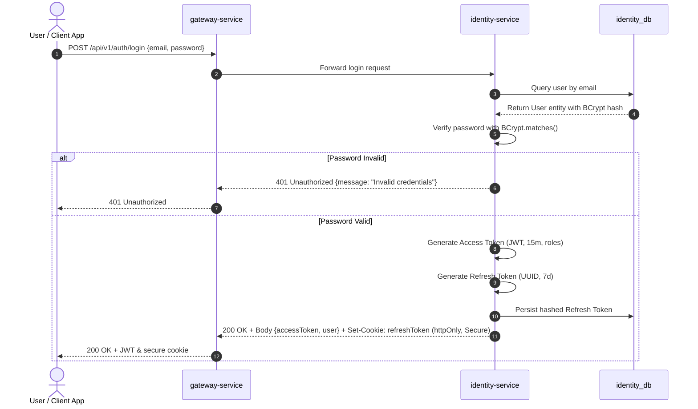
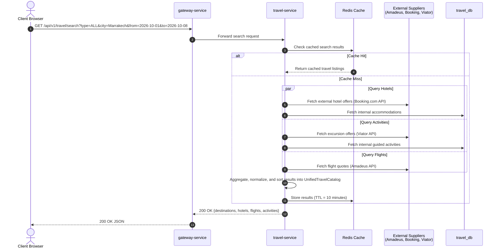
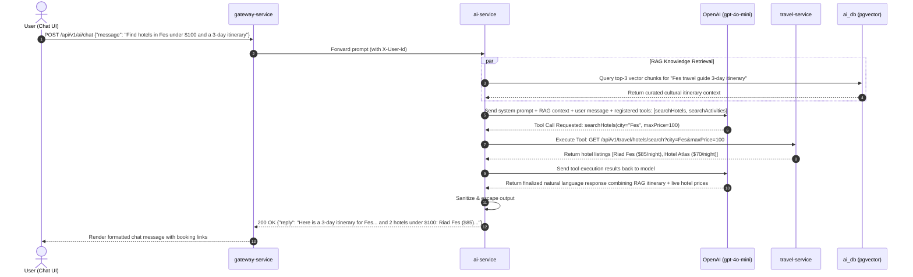

# Yuding V2 — Technical Architecture Specification

**Date:** September 19, 2026  
**Status:** Approved Architecture Baseline  
**Target Branch:** `develop-v2`  
**Supersedes:** Yuding V1 Monolithic/Prototype Microservice Architecture  

---

## 1. Executive Summary & Architectural Vision

Yuding V2 is an enterprise-grade, cloud-native travel booking and exploration platform. Transitioning from the prototype architecture of V1, V2 adopts a hardened, event-driven microservices architecture built on **Spring Boot 3.4.x**, **Spring Cloud 2024.x**, **PostgreSQL 16** with **pgvector**, and a unified **Next.js (React 19 + TypeScript)** frontend.

### 1.1 Core Architectural Principles

1. **Zero-Trust Security & Stateless Auth:**  
   Authentication is completely separated from application domains into a dedicated `identity-service`. All access uses digitally signed, short-lived JSON Web Tokens (JWT) with rotating refresh tokens. Passwords use BCrypt (strength 12). Client-side authentication state is never trusted.
2. **Strict Domain Boundaries & Database-per-Service:**  
   No two microservices share a database instance or schema. Cross-service data queries occur via explicit synchronous REST/Feign APIs or asynchronous event replication.
3. **Unified Travel Domain via Provider Adapter Pattern:**  
   Rather than creating fragmented microservices for each transportation and accommodation mode (e.g. separate hotel, flight, or taxi services), a single **`travel-service`** owns the unified catalog, search, and availability lifecycle, abstracting external travel providers (Amadeus, Booking.com, Viator, local transfer dispatchers) behind clean internal interfaces.
4. **Resilient Booking & Payment Orchestration (Saga Pattern):**  
   The booking lifecycle is strictly governed by `booking-service` using an orchestrated Saga pattern. Financial operations are delegated exclusively to `payment-service`, ensuring full PCI-DSS compliance through Stripe Elements and webhooks with zero sensitive cardholder data entering Yuding systems.
5. **Conversational AI with Dynamic Tool Calling & RAG:**  
   `ai-service` provides an intelligent travel concierge powered by OpenAI and Spring AI. The assistant leverages LLM function calling (tools) to execute real-time searches and booking queries across `travel-service` and `booking-service`, backed by vector similarity retrieval (pgvector) for curated destination guides.
6. **Role-Based Admin Protection (No Separate Admin Service):**  
   Administrative operations are not segmented into a separate backend service. Administrative capabilities are role-protected endpoints (`ROLE_ADMIN`) embedded directly in their respective domain services and enforced at both the API Gateway and service controller layers.

---

## 2. Final Microservices Inventory

Yuding V2 consists of **9 core microservices**:

| Service Name | Port | Primary Framework | Persistence | Core Responsibility |
|---|---|---|---|---|
| **`gateway-service`** | `8888` | Spring Cloud Gateway (Reactive) | Redis (Rate limiting & sessions) | Unified ingress, SSL termination, CORS, JWT claims propagation, path-based routing. |
| **`identity-service`** | `8081` | Spring Boot 3, Spring Security 6 | PostgreSQL (`identity_db`) | User registration, authentication, JWT issuance & verification, profile management, RBAC (`ROLE_USER`, `ROLE_ADMIN`, `ROLE_SUPPORT`). |
| **`travel-service`** | `8082` | Spring Boot 3, Spring Data JPA | PostgreSQL (`travel_db`), Redis (Catalog cache) | Consolidated travel catalog (Flights, Hotels, Activities, Transfers, Destinations) via Provider Adapters. |
| **`booking-service`** | `8083` | Spring Boot 3, Spring Data JPA | PostgreSQL (`booking_db`) | Booking lifecycle, reservations state machine (`PENDING`, `CONFIRMED`, `CANCELLED`, `REFUNDED`), pricing calculations, Saga orchestration. |
| **`payment-service`** | `8084` | Spring Boot 3, Spring Data JPA | PostgreSQL (`payment_db`) | Payment orchestration, Stripe integration, idempotency, webhook processing, refund execution, PCI-DSS compliance. |
| **`notification-service`**| `8085` | Spring Boot 3, JavaMail, SendGrid | PostgreSQL (`notification_db`) | Transactional emails (confirmations, receipts, password resets, alerts), async event consumption. |
| **`ai-service`** | `7777` | Spring AI / Spring Boot 3 | PostgreSQL + `pgvector` (`ai_db`) | Conversational assistant, LLM function calling (tools), vector embeddings, destination RAG knowledge base. |
| **`discovery-service`**| `8761` | Spring Cloud Netflix Eureka | Memory | Service registry, health monitoring, instance heartbeat tracking, dynamic service discovery. |
| **`config-service`** | `9091` | Spring Cloud Config Server | Git / Native File Repository | Centralized externalized configuration management, environment profiles (`dev`, `stage`, `prod`), secret injection. |

---

## 3. Detailed Service Responsibilities

### 3.1 `gateway-service` (Port: 8888)
- **Ingress Management:** Single public entry point for all frontend traffic (`https://api.yuding.com` or `http://localhost:8888`).
- **Dynamic Service Routing:** Routes incoming requests to target services discovered through Eureka (`lb://IDENTITY-SERVICE`, `lb://TRAVEL-SERVICE`, etc.).
- **Security Filter & Pre-Auth Validation:** Validates incoming JWT access tokens at the perimeter, verifies token expiration and signatures, extracts user identity and roles, and injects trusted downstream headers (`X-User-Id`, `X-User-Email`, `X-User-Roles`).
- **CORS Enforcement:** Centralized Cross-Origin Resource Sharing policy allowing only authorized frontend origins (e.g., `http://localhost:3000` in dev, `https://yuding.com` in prod).
- **Rate Limiting & Traffic Shaping:** Redis-backed Token Bucket filter protecting downstream endpoints against abuse, brute-force attacks, and DDoS.

### 3.2 `identity-service` (Port: 8081)
- **Authentication & Authorization:** Replaces legacy V1 `userController` and `adminController`. Issues cryptographically secure access tokens (RS256 signed, 15-minute lifespan) and refresh tokens (stored hashed in DB, 7-day lifespan).
- **Credential Storage:** High-entropy password hashing using BCrypt with salt rounds $\ge 12$. Zero plaintext password storage.
- **Account Lifecycle:** User registration, email verification flows, password reset tokens, account activation, profile updates.
- **Role-Based Access Control (RBAC):** Manages user roles (`ROLE_USER`, `ROLE_ADMIN`, `ROLE_SUPPORT`) and granular permissions.
- **Audit Logging:** Records security events (login success/failure, privilege changes, account lockouts).

### 3.3 `travel-service` (Port: 8082)
- **Consolidated Catalog Ownership:** Replaces the fragmented and partially hardcoded V1 catalog. Owns all travel products:
  - **Flights:** One-way, round-trip, multi-city route search, fare classes, cabin details.
  - **Hotels / Accommodations:** Hotels, Riads, apartments, room categories, amenities, availability windows.
  - **Activities:** Guided tours, excursions, cultural visits, tickets, scheduling.
  - **Transfers:** Airport transfers, private chauffeurs, city taxis, inter-city train connections.
  - **Destinations & Points of Interest:** City guides, destination highlights, climate, local guidelines.
- **The Provider Adapter Pattern:** External suppliers and internal databases are accessed exclusively through provider adapters:
  - `FlightProviderAdapter` $\rightarrow$ Amadeus Flight Offers API / Skyscanner.
  - `HotelProviderAdapter` $\rightarrow$ Booking.com Rapid API / Hotelbeds / Internal inventory.
  - `ActivityProviderAdapter` $\rightarrow$ Viator API / Internal catalog.
  - `TransferProviderAdapter` $\rightarrow$ Local dispatch / ONCF train schedules / Internal fleet.
- **Caching & Performance:** Caches search results and external supplier quotes in Redis with short TTL (5–15 minutes) to minimize third-party API costs and latency.
- **Admin Catalog Management:** Role-protected (`ROLE_ADMIN`) REST endpoints for creating, updating, activating, and deactivating internal catalog entries.

### 3.4 `booking-service` (Port: 8083)
- **Booking Lifecycle & State Machine:** Owns the complete state lifecycle of a customer reservation:
  $$\text{DRAFT} \longrightarrow \text{PENDING} \longrightarrow \text{CONFIRMED} \longrightarrow \text{COMPLETED} \quad (\text{or } \text{CANCELLED} / \text{REFUNDED})$$
- **Server-Authoritative Pricing:** Completely eliminates the V1 client-side pricing flaw (`100 * persons * days`). Calculates authoritative prices based on item units, dates, provider quotes, taxes, and service fees.
- **Cart & Reservation Aggregation:** Allows booking multi-item itineraries (e.g., flight + hotel + excursion in a single booking).
- **Saga Orchestrator:** Coordinates the distributed transaction between `booking-service`, `payment-service`, and `notification-service`. Holds inventory reservations temporarily (e.g. 15-minute lock) pending payment capture.
- **Customer Booking Management:** Endpoints for users to list their bookings, retrieve receipts, and request cancellations.
- **Admin Oversight:** Endpoints for `ROLE_ADMIN` and `ROLE_SUPPORT` to inspect platform-wide reservations, override statuses, and manage disputes.

### 3.5 `payment-service` (Port: 8084)
- **PCI-DSS Level 1 Compliance:** Completely replaces the insecure V1 payment controller. Zero storage or handling of raw Primary Account Numbers (PAN), CVVs, or cardholder credentials.
- **Stripe PSP Orchestration:**
  - Creates Stripe `PaymentIntent` objects tied to authoritative booking totals.
  - Delivers `client_secret` to the frontend for secure Stripe Elements / Apple Pay / Google Pay processing.
  - Ingests and cryptographically verifies asynchronous Stripe Webhooks (`payment_intent.succeeded`, `payment_intent.payment_failed`, `charge.refunded`).
- **Idempotency & Double-Charge Protection:** All payment operations require unique idempotency keys (`booking_id` + transaction attempt) stored in `payment_db`.
- **Refund & Reversal Processing:** Handles partial and full refunds triggered by booking cancellations or support interventions.
- **Audit Ledger:** Maintains an immutable transaction ledger recording gateway transaction IDs, amounts, currencies, payment methods, and timestamps.

### 3.6 `notification-service` (Port: 8085)
- **Asynchronous Event Processing:** Subscribes to platform domain events (`BookingConfirmedEvent`, `PaymentFailedEvent`, `UserRegisteredEvent`, `BookingCancelledEvent`).
- **Templated Communications:** Renders responsive HTML emails and notifications using Thymeleaf templates:
  - Welcome & email confirmation message.
  - Complete booking voucher with QR code and breakdown.
  - Payment receipt and invoice attachment.
  - Cancellation notice and refund status updates.
- **Multi-Channel Provider Abstraction:**
  - Primary email delivery: SendGrid API / AWS SES / SMTP.
  - SMS & WhatsApp alerts (optional/future phase): Twilio / MessageBird adapter.
- **Delivery Tracking & Retry:** Tracks notification status (`QUEUED`, `SENT`, `FAILED`, `BOUNCED`) with exponential backoff retries.

### 3.7 `ai-service` (Port: 7777)
- **Conversational Travel Concierge:** Spring AI / OpenAI integration replacing the vulnerable V1 prototype.
- **Dynamic Tool Calling (Function Calling):** The model dynamically invokes registered microservice tools during conversations:
  - `searchAccommodations(location, checkIn, checkOut, guests, maxPrice)`
  - `searchFlights(origin, destination, departureDate, cabinClass)`
  - `searchActivities(city, category, date)`
  - `checkBookingStatus(bookingReference, userEmail)`
- **Retrieval-Augmented Generation (RAG):**
  - Uses `pgvector` in PostgreSQL for vector similarity searches (cosine distance).
  - Ingests markdown destination guides, cultural itineraries, local tips, and travel advisories.
  - Prompts are augmented with retrieved context chunks before calling the LLM, grounding responses and eliminating hallucinations.
- **Safety & Prompt Hardening:** Enforces strict boundary prompts restricting the assistant to travel assistance, input sanitization, and Markdown escaping to eliminate stored XSS.

### 3.8 `discovery-service` (Port: 8761)
- **Eureka Service Registry:** Maintained as the service discovery backbone for Spring Cloud.
- **Dynamic Topology:** Enables zero-downtime rolling deployments, horizontal scaling of worker nodes, and automatic deregistration of unhealthy instances.
- **Health Verification:** Integrates with Spring Boot Actuator health checks (`/actuator/health`).

### 3.9 `config-service` (Port: 9091)
- **Centralized Configuration Management:** Maintained to provide externalized configuration for all microservices across development, staging, and production environments.
- **Clean Repository Architecture:** Resolves the broken V1 submodule issue. Configurations are stored in a dedicated configuration directory within the repository or an external Git/Vault repository, read natively or via environment profiles.
- **Secret Encryption:** Integrates symmetric or asymmetric encryption for database passwords, API keys, and Stripe secrets (`{cipher}...`).

---

## 4. Architectural Topology & Dependency Map

### 4.1 System Topology Diagram

```mermaid
flowchart TD
    Client["Client Browsers / Mobile App<br/>(Next.js 19 Frontend)"]
    
    subgraph Edge Layer
        Gateway["gateway-service<br/>Port 8888<br/>(Spring Cloud Gateway + Redis)"]
    end

    subgraph Service Discovery & Configuration
        Eureka["discovery-service<br/>Port 8761<br/>(Netflix Eureka)"]
        Config["config-service<br/>Port 9091<br/>(Spring Cloud Config)"]
    end

    subgraph Core Domain Services
        Identity["identity-service<br/>Port 8081<br/>(Auth, Users, RBAC)"]
        Travel["travel-service<br/>Port 8082<br/>(Flights, Hotels, Activities, Transfers)"]
        Booking["booking-service<br/>Port 8083<br/>(Booking Lifecycle & Saga)"]
        Payment["payment-service<br/>Port 8084<br/>(Stripe & Idempotent Ledger)"]
        Notification["notification-service<br/>Port 8085<br/>(Email, SMS & Templates)"]
        AI["ai-service<br/>Port 7777<br/>(Spring AI, Tools, RAG)"]
    end

    subgraph Persistence Layer (PostgreSQL 16)
        DB_Identity[("identity_db")]
        DB_Travel[("travel_db")]
        DB_Booking[("booking_db")]
        DB_Payment[("payment_db")]
        DB_Notification[("notification_db")]
        DB_Vector[("ai_vector_db<br/>(pgvector)")]
    end

    subgraph External Providers & Third-Party APIs
        StripeAPI["Stripe Payments API<br/>(PCI-DSS Compliant)"]
        TravelSuppliers["External Travel Providers<br/>(Amadeus, Booking.com, Viator)"]
        OpenAIAPI["OpenAI API<br/>(gpt-4o-mini / Embeddings)"]
        EmailProvider["Email Gateway<br/>(SendGrid / AWS SES)"]
    end

    %% Client Ingress
    Client -->|HTTPS / REST| Gateway

    %% Infrastructure Dependencies
    Core Domain Services -.->|Register & Heartbeat| Eureka
    Core Domain Services -.->|Fetch Configuration| Config
    Gateway -.->|Route Discovery| Eureka

    %% Gateway Routing
    Gateway -->|/api/v1/auth/**| Identity
    Gateway -->|/api/v1/travel/**| Travel
    Gateway -->|/api/v1/bookings/**| Booking
    Gateway -->|/api/v1/payments/**| Payment
    Gateway -->|/api/v1/ai/**| AI

    %% Inter-Service Feign / Internal Calls
    Booking -->|Verify Catalog & Pricing| Travel
    Booking -->|Initiate Payment| Payment
    Booking -->|Dispatch Notifications| Notification
    AI -->|Tool Call: Query Catalog| Travel
    AI -->|Tool Call: Query Bookings| Booking

    %% Database Ownership
    Identity --- DB_Identity
    Travel --- DB_Travel
    Booking --- DB_Booking
    Payment --- DB_Payment
    Notification --- DB_Notification
    AI --- DB_Vector

    %% External Connections
    Payment -->|HTTPS| StripeAPI
    Travel -->|HTTPS / Adapters| TravelSuppliers
    AI -->|HTTPS| OpenAIAPI
    Notification -->|SMTP / API| EmailProvider
```

### 4.2 Inter-Service Communication Matrix

| Source Service | Target Service | Interaction Type | Protocol / Mechanism | Purpose | Resilience Strategy |
|---|---|---|---|---|---|
| `gateway-service` | All Domain Services | Synchronous | HTTP/2 / Reactive WebClient | Forwarding public API requests. | Circuit Breaker, Gateway Timeout (5s), Retry (2x). |
| `booking-service` | `travel-service` | Synchronous | REST via OpenFeign | Validate availability, fetch authoritative prices. | Circuit Breaker, Fallback to cached catalog quote. |
| `booking-service` | `payment-service` | Synchronous / Async | REST / Event-Driven | Create PaymentIntent, capture or refund charge. | Idempotency Key, Saga compensation rollback. |
| `booking-service` | `notification-service` | Asynchronous | Event / REST | Dispatch booking confirmations, ticket vouchers. | Retry queue, Dead Letter Queue (DLQ). |
| `ai-service` | `travel-service` | Synchronous | REST via OpenFeign | Execute dynamic tool calling for real-time travel quotes. | Strict timeout (3s), fallback to general travel advice. |
| `ai-service` | `booking-service` | Synchronous | REST via OpenFeign | Tool call to look up user reservation status. | User authentication token propagation, 3s timeout. |
| `payment-service` | `notification-service` | Asynchronous | Event / REST | Send payment receipts or failure alerts. | Asynchronous fire-and-forget with retry. |

---

## 5. External Provider Boundaries & The Provider Adapter Pattern

In Yuding V2, no external supplier's API data structures are permitted to leak into the internal domain model. The **`travel-service`** encapsulates all supplier interactions behind strict internal interfaces using the **Provider Adapter Pattern**.

```
                           +----------------------------------------+
                           |             travel-service             |
                           |                                        |
                           |   +--------------------------------+   |
                           |   |       Core Travel Domain       |   |
                           |   |  - FlightOffer, HotelListing   |   |
                           |   |  - Activity, Transfer          |   |
                           |   +---------------+----------------+   |
                           |                   |                    |
                           |      [Provider Adapter SPI]            |
                           |      +------------+------------+       |
                           +------|------------|------------|-------+
                                  |            |            |
                                  v            v            v
                           +------------+ +------------+ +------------+
                           |  Amadeus   | | Booking.com| |  Internal  |
                           |  Adapter   | |  Adapter   | |  Catalog   |
                           +-----+------+ +-----+------+ +-----+------+
                                 |              |              |
                                 v              v              v
                           [Amadeus API] [Booking API]   [travel_db]
```

### 5.1 Provider Adapters in `travel-service`

1. **`FlightProviderAdapter` Interface:**
   - Methods: `searchFlights(criteria)`, `validateFlightFare(flightId)`, `reserveFlightHold(flightId, passengerDetails)`.
   - Implementations: `AmadeusFlightAdapter`, `MockFlightAdapter` (for local development/testing).
2. **`HotelProviderAdapter` Interface:**
   - Methods: `searchHotels(criteria)`, `getHotelDetails(hotelId)`, `checkRoomAvailability(roomId, dates)`.
   - Implementations: `BookingDotComAdapter`, `InternalHotelCatalogAdapter`.
3. **`ActivityProviderAdapter` Interface:**
   - Methods: `searchActivities(criteria)`, `getActivityAvailability(activityId, date)`.
   - Implementations: `ViatorActivityAdapter`, `InternalActivityCatalogAdapter`.
4. **`TransferProviderAdapter` Interface:**
   - Methods: `searchTransfers(pickup, dropoff, date, vehicleType)`, `quoteTransferPrice(...)`.
   - Implementations: `LocalDispatcherTransferAdapter`, `OncfTrainAdapter`.

### 5.2 Provider Adapters in `payment-service`

- **`PaymentGatewayAdapter` Interface:**
  - Methods: `createIntent(amount, currency, customerEmail, idempotencyKey)`, `capturePayment(intentId)`, `refundPayment(paymentId, amount, reason)`.
  - Implementation: **`StripePaymentGatewayAdapter`** (uses official `stripe-java` SDK).
  - Designed for zero raw card exposure: The frontend utilizes Stripe Elements to collect card details directly to Stripe's tokenization servers, returning a `paymentMethodId` or confirmation token to the backend.

### 5.3 Provider Adapters in `notification-service`

- **`EmailGatewayAdapter` Interface:**
  - Methods: `sendHtmlEmail(recipient, subject, htmlContent, attachments)`.
  - Implementations: `SendGridEmailAdapter` (production), `SmtpEmailAdapter` (development / MailHog).

---

## 6. Database Ownership & Data Boundary Architecture

Yuding V2 enforces strict **Database-per-Service** isolation using dedicated databases inside a single managed **PostgreSQL 16** cluster. Cross-database foreign keys, joins, and shared schemas are strictly prohibited.

```
+----------------------------------------------------------------------------------------------------+
|                                    PostgreSQL 16 Cluster                                           |
|                                                                                                    |
|  +--------------------+  +--------------------+  +--------------------+  +-----------------------+ |
|  |    identity_db     |  |     travel_db      |  |     booking_db     |  |      payment_db       | |
|  | - users            |  | - destinations     |  | - bookings         |  | - transactions        | |
|  | - roles            |  | - accommodations   |  | - booking_items    |  | - payment_intents     | |
|  | - refresh_tokens   |  | - activities       |  | - travelers        |  | - refund_records      | |
|  | - audit_logs       |  | - transports       |  | - status_history   |  | - payment_methods     | |
|  |                    |  | - reviews          |  |                    |  |                       | |
|  +--------------------+  +--------------------+  +--------------------+  +-----------------------+ |
|                                                                                                    |
|  +--------------------+  +-----------------------------------------------------------------------+ |
|  |  notification_db   |  |                              ai_db                                    | |
|  | - message_logs     |  | - vector_store (pgvector HNSW extension)                              | |
|  | - email_templates  |  | - destination_embeddings, document_chunks                             | |
|  | - delivery_status  |  | - chat_conversations, chat_messages                                   | |
|  +--------------------+  +-----------------------------------------------------------------------+ |
+----------------------------------------------------------------------------------------------------+
```

### 6.1 Database Boundaries & Schema Ownership

| Database Name | Owning Service | Allowed Readers / Writers | Primary Tables | Consistency Strategy |
|---|---|---|---|---|
| `identity_db` | `identity-service` | `identity-service` only | `users`, `roles`, `user_roles`, `refresh_tokens`, `login_audit` | ACID relational; user details referenced by UUID (`user_id`) downstream. |
| `travel_db` | `travel-service` | `travel-service` only | `destinations`, `accommodations`, `room_types`, `activities`, `transfers`, `reviews`, `catalog_cache` | ACID relational; catalog products referenced by composite IDs (`item_type` + `item_id`). |
| `booking_db` | `booking-service` | `booking-service` only | `bookings`, `booking_items`, `travelers`, `booking_status_log` | ACID local; eventual consistency across services via Saga. |
| `payment_db` | `payment-service` | `payment-service` only | `payments`, `payment_intents`, `refunds`, `idempotency_keys` | Strict ACID with row-level locking for double-charge prevention. |
| `notification_db` | `notification-service`| `notification-service` only | `notification_queue`, `dispatch_logs`, `templates` | Append-only audit logs and retry queues. |
| `ai_db` | `ai-service` | `ai-service` only | `document_chunks`, `embeddings` (VECTOR 1536), `chat_sessions`, `chat_history` | Vector similarity indexing (HNSW) + session persistence. |

---

## 7. Security, Authentication & Role-Based Access Architecture

### 7.1 Zero-Trust Perimeter Security
1. **Perimeter Authentication at `gateway-service`:**
   - Public routes (`/api/v1/auth/login`, `/api/v1/auth/register`, `/api/v1/travel/search/**`) are accessible anonymously.
   - Protected routes require an `Authorization: Bearer <JWT>` header.
   - The Gateway decodes and validates the signature using `identity-service`'s public key (or shared secret), verifies expiration, and injects validated user attributes into downstream request headers:
     - `X-User-Id: <UUID>`
     - `X-User-Email: <email>`
     - `X-User-Roles: ROLE_USER,ROLE_ADMIN`
2. **Defense-in-Depth in Microservices:**
   - Each internal microservice configures Spring Security with an internal filter validating the injected `X-User-*` headers or evaluating the JWT locally.
   - Method-level security enforces granular privileges: `@PreAuthorize("hasRole('ADMIN')")`.

### 7.2 Role-Based Access Control (RBAC) Specification

Administrative capabilities are **not** an isolated microservice. Admin functionalities are protected domain operations within existing services:

| Role | Target Areas | Permitted Actions |
|---|---|---|
| **`ROLE_USER`** | Customer Portal, Travel Catalog, Bookings, AI Concierge | - Search travel catalog.<br/>- Create and manage own bookings.<br/>- Pay for own reservations.<br/>- Manage own profile and passwords.<br/>- Chat with AI travel assistant.<br/>- Post reviews and ratings. |
| **`ROLE_ADMIN`** | Admin Dashboard (`/admin/**`), Catalog Management, Analytics | - Full CRUD on internal travel catalog (hotels, activities, transfers).<br/>- View and search platform-wide bookings and transaction reports.<br/>- Manage user account statuses (suspend, activate).<br/>- Inspect system health metrics and audit logs.<br/>- Trigger manual refunds or override reservation states. |
| **`ROLE_SUPPORT`** | Support Dashboard, Reservation Lookup | - Read-only access to customer profiles and booking details.<br/>- Assist customers with itinerary changes or cancellations.<br/>- Resend email vouchers and booking receipts. |

---

## 8. High-Level Request Flows

### 8.1 User Authentication Flow (Registration & Login)



---

### 8.2 Unified Travel Search Flow (Provider Adapter Fan-Out)



---

### 8.3 Booking Creation & Payment Orchestration (Saga Pattern)

```mermaid
sequenceDiagram
    autonumber
    actor User as Customer Client
    participant GW as gateway-service
    participant BS as booking-service
    participant TS as travel-service
    participant PS as payment-service
    participant Stripe as Stripe PSP
    participant NS as notification-service

    %% Step 1: Draft & Price Confirmation
    User->>GW: POST /api/v1/bookings/create {items: [{itemId, type, dates}], travelerInfo}
    GW->>BS: Forward booking request (with X-User-Id header)
    BS->>TS: Re-validate availability & fetch authoritative price
    TS-->>BS: Price confirmed: $450.00
    BS->>BS: Create Booking record in booking_db (Status: PENDING_PAYMENT)
    
    %% Step 2: Payment Intent Creation
    BS->>PS: POST /api/v1/payments/intents {bookingId, amount: 450.00, currency: "USD"}
    PS->>Stripe: Create PaymentIntent (amount=45000, currency=usd, metadata={bookingId})
    Stripe-->>PS: Return PaymentIntent {id: "pi_123", client_secret: "cs_xyz"}
    PS->>PS: Record intent in payment_db (Status: REQUIRES_PAYMENT_METHOD)
    PS-->>BS: Return PaymentDetails {clientSecret: "cs_xyz"}
    BS-->>GW-->>User: 201 Created {bookingId: "B-998", clientSecret: "cs_xyz"}

    %% Step 3: Frontend Client Payment Submission
    User->>Stripe: Confirm payment via Stripe.js (card details submitted directly to Stripe)
    Stripe-->>User: Payment authorized successfully

    %% Step 4: Webhook Ingestion & Confirmation
    Stripe->>GW: POST /api/v1/payments/webhook (Signature: t=..., v1=...)
    GW->>PS: Forward verified webhook
    PS->>PS: Verify Stripe cryptographic signature
    PS->>PS: Update payment status to SUCCEEDED (idempotent)
    PS->>BS: POST /api/v1/bookings/B-998/confirm-payment {paymentId: "pi_123"}
    BS->>BS: Update Booking status to CONFIRMED
    
    %% Step 5: Notification Dispatch
    BS->>NS: POST /api/v1/notifications/send-booking-voucher {bookingId: "B-998"}
    NS->>User: Deliver booking confirmation email & PDF receipt
```

---

### 8.4 AI Travel Assistant with Dynamic Tool Calling Flow



---

## 9. Phased Implementation Roadmap

With Phase 3 (Repository Cleanup) and Phase 4 (V2 Architecture Specification) completed, the upcoming rebuild will proceed systematically:

| Phase | Name | Target Deliverables |
|---|---|---|
| **Phase 5** | **Cloud Infrastructure & Configuration** | Re-establish clean Eureka `discovery-service` and Spring Cloud `config-service`. Configure Docker Compose environment with PostgreSQL 16 (`pgvector`) and Redis. |
| **Phase 6** | **Identity & Security Service** | Implement `identity-service` with Spring Security 6, JWT generation/validation, BCrypt hashing, user/admin entities, and RBAC endpoints. |
| **Phase 7** | **Unified Travel Service** | Implement `travel-service` managing Flights, Hotels, Activities, Transfers, and Destinations. Implement Amadeus and Booking.com provider adapters with caching. |
| **Phase 8** | **Booking & Payment Services** | Implement `booking-service` lifecycle state machine and `payment-service` with Stripe PSP integration, idempotency ledger, and webhooks. |
| **Phase 9** | **Notification Service** | Implement `notification-service` with Thymeleaf responsive HTML email templates and SendGrid/SMTP dispatchers. |
| **Phase 10** | **AI Concierge Service** | Modernize `ai-service` using Spring AI 1.0, OpenAI function tool calling, and pgvector RAG document indexing. |
| **Phase 11** | **API Gateway & Routing Hardening** | Reconfigure `gateway-service` with dynamic Eureka routing, Redis token-bucket rate limiting, and CORS security. |
| **Phase 12** | **Next.js 19 Frontend Rebuild** | Build unified React 19 + Next.js App Router frontend referencing preserved V1 designs, integrating Stripe Elements and AI chat. |

---

## 10. Architectural Integrity Sign-Off

- **Consolidation Verified:** No independent `hotel-service`, `flight-service`, `activity-service`, or `taxi-service` exist. All travel catalog operations are housed in `travel-service`.
- **Infrastructure Preserved:** Eureka and Spring Cloud Config Server are retained and cleanly architected.
- **Admin Isolation Clarified:** Admin features are strictly role-based privileges within domain services (`ROLE_ADMIN`), not an isolated microservice.
- **Security & Payments Remediated:** Plaintext credentials and insecure PAN storage from V1 are permanently superseded by JWT stateless auth and Stripe PSP tokenization.
