# Yuding V2 — Booking Architecture & Lifecycle Specification

## 1. Executive Summary & Bounded Context

In Yuding V2, the **Booking** domain is owned by `reservation-service` (port `8090`), operating against the dedicated logical PostgreSQL schema `booking`.

Phase 33 establishes a robust, server-authoritative Booking domain model and state machine lifecycle. It decouples core reservation states from legacy monolithic structures while strictly isolating transactional boundaries from external real-world booking APIs and financial processors.

---

## 2. Personal / Demo Safety Model

> [!IMPORTANT]
> **Zero Real-World Transactional Side Effects**
> Yuding is an engineering demonstration platform. While search and discovery operations connect to live travel data providers (Scrappa, Nuitee, HBX, ONCF, Transitous), transactional states (`PAID`, `PENDING_PROVIDER_CONFIRMATION`, `CONFIRMED`, `REFUNDED`) are simulated domain states only.
>
> - **Provider Booking Calls Made:** EXACTLY 0.
> - **Payment Gateway Calls Made:** EXACTLY 0.
> - **Raw Card / PAN / CVV Storage:** Strictly prohibited and rejected.

---

## 3. Booking Aggregate Root

The aggregate root `Booking` resides in package `com.ahmed.reservationservice.domain.model.Booking` and maps directly to PostgreSQL table `booking.bookings`.

### Conceptual Fields

| Field | Type | Storage / Column | Nullable | Description |
|---|---|---|---|---|
| `id` | `UUID` | `id UUID PRIMARY KEY` | No | Internal technical identifier generated server-side |
| `userId` | `UUID` | `user_id UUID` | No | Authoritative resource owner resolved from authenticated JWT subject |
| `productType` | `ProductType` | `product_type VARCHAR(32)` | No | Travel vertical enum (`FLIGHT`, `HOTEL`, `ACTIVITY`, `TRANSFER`, `TRAIN`) |
| `status` | `BookingStatus` | `status VARCHAR(24)` | No | Strong enum persisted strictly as `VARCHAR` |
| `createdAt` | `Instant` | `created_at TIMESTAMPTZ` | No | UTC creation timestamp (immutable after creation) |
| `updatedAt` | `Instant` | `updated_at TIMESTAMPTZ` | No | UTC last-modified timestamp |
| `statusChangedAt` | `Instant` | `status_changed_at TIMESTAMPTZ` | No | UTC timestamp recording when current status became active |
| `expiresAt` | `Instant` | `expires_at TIMESTAMPTZ` | Yes | Expiration deadline for non-final early lifecycle states |
| `version` | `Integer` | `version INT` | No | JPA `@Version` optimistic locking counter preventing concurrent overwrites |

---

## 4. Lifecycle Statuses & State Machine

### 4.1 All 9 Required Statuses

```java
public enum BookingStatus {
    DRAFT,
    PENDING_PAYMENT,
    PAYMENT_FAILED,
    PAID,
    PENDING_PROVIDER_CONFIRMATION,
    CONFIRMED,
    CANCELLED,
    REFUNDED,
    EXPIRED;
}
```

1. **`DRAFT`**: Initial booking shell created by authenticated user.
2. **`PENDING_PAYMENT`**: Booking is locked for payment attempt with an active timer.
3. **`PAYMENT_FAILED`**: A payment attempt failed; may be retried back to `PENDING_PAYMENT` or cancelled/expired.
4. **`PAID`**: Payment captured successfully. Awaiting supplier confirmation workflow.
5. **`PENDING_PROVIDER_CONFIRMATION`**: Supplier inventory lock/booking in progress.
6. **`CONFIRMED`**: Confirmed by travel provider. Active booking.
7. **`CANCELLED`**: Cancelled by user or administrative action.
8. **`REFUNDED`**: Reversal of paid funds completed via refund workflow. Terminal state.
9. **`EXPIRED`**: Booking timed out prior to payment completion. Terminal state.

---

### 4.2 Lifecycle Transition Diagram

```mermaid
stateDiagram-v2
    [*] --> DRAFT : User Creates Draft
    DRAFT --> PENDING_PAYMENT : Lock For Payment
    DRAFT --> CANCELLED : User Cancels Draft
    DRAFT --> EXPIRED : Draft TTL Expiry

    PENDING_PAYMENT --> PAID : Payment Success
    PENDING_PAYMENT --> PAYMENT_FAILED : Payment Error
    PENDING_PAYMENT --> CANCELLED : User Abandons
    PENDING_PAYMENT --> EXPIRED : Payment Window Expiry

    PAYMENT_FAILED --> PENDING_PAYMENT : User Retries Payment
    PAYMENT_FAILED --> CANCELLED : User Cancels
    PAYMENT_FAILED --> EXPIRED : Timeout

    PAID --> PENDING_PROVIDER_CONFIRMATION : Submit to Supplier
    PAID --> REFUNDED : Early Refund

    PENDING_PROVIDER_CONFIRMATION --> CONFIRMED : Supplier Confirms
    PENDING_PROVIDER_CONFIRMATION --> REFUNDED : Supplier Fails / Refund

    CONFIRMED --> CANCELLED : Post-Confirmation Cancellation

    CANCELLED --> REFUNDED : Valid Refund Workflow

    REFUNDED --> [*] : Terminal State
    EXPIRED --> [*] : Terminal State
```



---

### 4.3 Strict 9x9 Transition Matrix

| Source Status | Allowed Target Statuses | Forbidden Target Statuses | Terminal? | Can Expire? |
|---|---|---|---|---|
| `DRAFT` | `PENDING_PAYMENT`, `CANCELLED`, `EXPIRED` | `PAID`, `PAYMENT_FAILED`, `PENDING_PROVIDER_CONFIRMATION`, `CONFIRMED`, `REFUNDED` | No | Yes |
| `PENDING_PAYMENT` | `PAID`, `PAYMENT_FAILED`, `CANCELLED`, `EXPIRED` | `DRAFT`, `PENDING_PROVIDER_CONFIRMATION`, `CONFIRMED`, `REFUNDED` | No | Yes |
| `PAYMENT_FAILED` | `PENDING_PAYMENT`, `CANCELLED`, `EXPIRED` | `DRAFT`, `PAID`, `PENDING_PROVIDER_CONFIRMATION`, `CONFIRMED`, `REFUNDED` | No | Yes |
| `PAID` | `PENDING_PROVIDER_CONFIRMATION`, `REFUNDED` | `DRAFT`, `PENDING_PAYMENT`, `PAYMENT_FAILED`, `CONFIRMED`, `CANCELLED`, `EXPIRED` | No | No |
| `PENDING_PROVIDER_CONFIRMATION` | `CONFIRMED`, `REFUNDED` | `DRAFT`, `PENDING_PAYMENT`, `PAYMENT_FAILED`, `PAID`, `CANCELLED`, `EXPIRED` | No | No |
| `CONFIRMED` | `CANCELLED` | `DRAFT`, `PENDING_PAYMENT`, `PAYMENT_FAILED`, `PAID`, `PENDING_PROVIDER_CONFIRMATION`, `REFUNDED`, `EXPIRED` | No | No |
| `CANCELLED` | `REFUNDED` (via valid refund workflow) | `DRAFT`, `PENDING_PAYMENT`, `PAYMENT_FAILED`, `PAID`, `PENDING_PROVIDER_CONFIRMATION`, `CONFIRMED`, `EXPIRED` | No | No |
| `REFUNDED` | *(None)* | All transitions rejected | **Yes** | No |
| `EXPIRED` | *(None)* | All transitions rejected | **Yes** | No |

---

## 5. Security & Ownership Architecture

### 5.1 Defense in Depth & Token Authority
- **No Client Authority:** Frontend never supplies `userId`, `status`, `price`, or `paymentStatus`.
- **JWT Subject Extraction:** `SecurityUtils.getCurrentUserUuid()` extracts the authenticated user's UUID directly from the RS256 token subject.
- **Gateway & Service Enforcement:** Enforced both at API Gateway (`8888`) and downstream in `reservation-service` (`8090`).
- **Owner vs. Privileged Access:**
  - Standard users can only view and cancel their own bookings (`user_id == authenticated_subject`).
  - Roles `ROLE_ADMIN` and `ROLE_SUPPORT` have privileged access for operational support.

### 5.2 Optimistic Locking Concurrency Control
- Concurrency protection is enforced via JPA `@Version` on column `version`.
- If two processes concurrently load `PENDING_PAYMENT` and attempt conflicting updates (e.g., Process A transitions to `PAID` while Process B transitions to `CANCELLED`), the first commit increments the version from `0` to `1`.
- The second commit encounters a version mismatch, triggering `ObjectOptimisticLockingFailureException`, which is mapped to `BookingConflictException` (HTTP 409 Conflict).

---

## 6. Expiration Semantics & TTL Policy

Expiration is managed through configurable properties (`yuding.booking.lifecycle`):
- `draftTtlMinutes`: 30 minutes (default).
- `pendingPaymentTtlMinutes`: 15 minutes (default).

### Evaluation Strategy
- **Lazy Evaluation on Access:** Whenever a booking is loaded via `getBooking(...)` or service commands, `booking.isExpired(now)` checks if `now > expiresAt`. If expired, it automatically transitions to `EXPIRED` and saves the updated state.
- **Non-Expiring States:** `PAID`, `PENDING_PROVIDER_CONFIRMATION`, `CONFIRMED`, `CANCELLED`, and `REFUNDED` clear `expiresAt` (`null`) and never naturally expire.

---

## 7. Database Migration (Flyway V13)

Flyway is the sole DDL authority. Migration `V13__booking_lifecycle_architecture.sql` updates `booking.bookings`:
1. Drops outdated status constraints and enforces the `chk_bookings_status` constraint for all 9 statuses.
2. Adds `product_type VARCHAR(32)` with check constraint `('FLIGHT', 'HOTEL', 'ACTIVITY', 'TRANSFER', 'TRAIN')`.
3. Adds `status_changed_at TIMESTAMPTZ NOT NULL DEFAULT now()`.
4. Relaxes `booking_reference`, `total_amount`, and `currency` to `NULL` to decouple Phase 33 from future Reference and Pricing phases.
5. Adds index `idx_bookings_user_created ON booking.bookings (user_id, created_at DESC)`.

---

## 8. Roadmap Boundaries & Decoupling

| Concept | Owning Phase | Status in Phase 33 |
|---|---|---|
| **Booking Reference** (e.g. `YUD-2026-XXXXXX`) | Phase 34 | Not implemented; internal UUID used exclusively |
| **Offer Snapshots** (Immutable JSON payload) | Phase 35 | Not implemented; decoupled from core lifecycle |
| **Provider Revalidation / Repricing** | Phase 36 | Not implemented; search remains discovery-only |
| **Server-Authoritative Pricing** | Phase 37 | Not implemented; client prices never accepted |
| **PaymentProvider Abstraction & Gateway** | Phase 38 | Not implemented; no external PSP calls |
| **Idempotency Keys** | Phase 41 | Not implemented |
