# Yuding V2 — Normalized Database Design Specification

**Date:** September 19, 2026  
**Status:** Approved Database Design Baseline (Phase 7)  
**Target Branch:** `develop-v2`  
**Target Platform:** PostgreSQL 16 with `pgvector`  
**Database Name:** `yuding`  

---

## 1. Executive Summary & Core Design Tenets

This document specifies the complete, normalized relational and vector data model for the Yuding V2 travel reservation and exploration platform. Yuding V2 consolidates data persistence into a **single PostgreSQL 16 cluster** hosting one database (`yuding`) partitioned into **8 isolated logical schemas**:

1. **`identity`** — User credentials, roles, token lifecycle, security authenticators.
2. **`travel`** — Universal travel catalog (Destinations, Accommodations, Flights, Activities, Transfers, Supplier Cache).
3. **`booking`** — Booking lifecycle, multi-item itinerary cart, travelers, authoritative price snapshots.
4. **`payment`** — Payment provider-neutral ledger, intents, webhook events, refunds, idempotency keys.
5. **`notification`** — Asynchronous notification queues, delivery logs, templates, recipient preferences.
6. **`engagement`** — Verified reviews, ratings, user favorites, search history, saved itineraries.
7. **`ai`** — RAG documents, text chunks, vector embeddings (`pgvector(1536)`), chat sessions, tool logs.
8. **`audit`** — Cross-cutting immutable security events, administrative audit trails, login tracking.

### 1.1 Core Rules & Data Integrity Standards

- **Strict Schema Ownership & Zero Cross-Schema Foreign Keys:**  
  Each microservice strictly owns its assigned schema. **No foreign key constraints are permitted across different schemas.** Entities in separate schemas reference each other through loose logical identifiers (UUIDs). Cross-domain operations must occur via REST/OpenFeign APIs or asynchronous domain events.
- **Consistent Identifier Strategy:**  
  - **UUIDv4 (`UUID`)** is used as primary keys for all domain entities, external-facing objects, tokens, and multi-tenant records to eliminate sequential ID enumeration attacks and IDOR vulnerabilities.
  - **`BIGINT GENERATED ALWAYS AS IDENTITY`** is used for high-velocity internal log and history tables (`booking_status_history`, `payment_events`, `delivery_attempts`, `search_history`, `audit_events`).
- **Precision Monetary Values:**  
  All monetary amounts, fares, and prices use **`NUMERIC(12, 2)`** (or `NUMERIC(14, 4)` for exchange rates/fractions). The use of `FLOAT` or `DOUBLE` for financial amounts is strictly forbidden.
- **PCI-DSS Level 1 & Zero Sensitive Card Storage:**  
  Raw Primary Account Numbers (PAN), CVVs, and magnetic stripe data are **never** persisted in any table or column. The payment schema stores only opaque provider tokens (`provider_transaction_id`, `client_secret_hash`, `payment_method_token`).
- **Cryptographic Credential Security:**  
  All user passwords use BCrypt hashing (cost $\ge 12$). Password reset and email verification tokens store SHA-256 digests (`token_hash`), never raw token strings.
- **Optimistic Concurrency Control:**  
  Transactional entities subject to concurrent state changes (`bookings`, `payments`, `users`, `accommodations`) include an integer `version INT DEFAULT 0 NOT NULL` column for optimistic locking.
- **Standardized Audit Timestamps:**  
  Every table includes `created_at TIMESTAMPTZ NOT NULL DEFAULT now()`, and mutable entities include `updated_at TIMESTAMPTZ NOT NULL DEFAULT now()`.

---

## 2. Schema Ownership & Boundary Matrix

| Schema Name | Owning Microservice | Allowed Read/Write | Core Domain Responsibilities | Isolation Rule |
|---|---|---|---|---|
| **`identity`** | `identity-service` | `identity-service` only | Users, roles, credentials, permissions, refresh tokens, email/password tokens. | Other services reference users via logical `user_id UUID`. Direct SQL joins prohibited. |
| **`travel`** | `travel-service` | `travel-service` only | Destinations, accommodations, room types, flight offers, activities, transfers, supplier cache. | Items referenced downstream via composite logical ID (`item_type` + `item_id`). |
| **`booking`** | `booking-service` | `booking-service` only | Bookings, booking items, travelers, price snapshots, status history. | Owns reservation lifecycle. References `user_id` and catalog item UUIDs logically. |
| **`payment`** | `payment-service` | `payment-service` only | Payment intents, transactions ledger, refunds, idempotency keys. | Owns financial ledger. References `booking_id UUID` logically. |
| **`notification`**| `notification-service`| `notification-service` only | Notification queue, delivery attempts, email/SMS templates. | Dispatches communications based on domain event payloads. |
| **`engagement`** | `travel-service` | `travel-service` only | Customer reviews, ratings, favorites, search history, saved trips. | Tied to catalog item UUIDs and verified booking UUIDs. |
| **`ai`** | `ai-service` | `ai-service` only | Vector embeddings, document chunks, chat conversations, tool call logs. | Hosts `pgvector` extension; completely isolated vector store. |
| **`audit`** | Cross-cutting | Appended by domain services | Tamper-evident security logs, admin actions, login attempts. | Append-only partition for compliance and audit analysis. |

---

## 3. Entity-Relationship Diagram (ERD)

```mermaid
erDiagram
    %% IDENTITY SCHEMA
    identity_users ||--o{ identity_user_roles : "has"
    identity_roles ||--o{ identity_user_roles : "assigned to"
    identity_users ||--o{ identity_refresh_tokens : "owns"
    identity_users ||--o{ identity_email_verification_tokens : "receives"
    identity_users ||--o{ identity_password_reset_tokens : "requests"

    %% TRAVEL SCHEMA
    travel_destinations ||--o{ travel_accommodations : "contains"
    travel_destinations ||--o{ travel_activities : "hosts"
    travel_destinations ||--o{ travel_transfers : "originates/terminates"
    travel_providers ||--o{ travel_accommodations : "supplies"
    travel_providers ||--o{ travel_flights : "operates"
    travel_providers ||--o{ travel_activities : "operates"
    travel_providers ||--o{ travel_transfers : "operates"
    travel_providers ||--o{ travel_provider_offers : "caches"
    travel_accommodations ||--o{ travel_room_types : "has"

    %% BOOKING SCHEMA
    booking_bookings ||--|{ booking_booking_items : "contains"
    booking_bookings ||--|{ booking_travelers : "includes"
    booking_bookings ||--o{ booking_offer_snapshots : "locks"
    booking_bookings ||--o{ booking_booking_status_history : "records"

    %% PAYMENT SCHEMA
    payment_payments ||--o{ payment_payment_events : "tracks"
    payment_payments ||--o{ payment_refunds : "reverses"

    %% NOTIFICATION SCHEMA
    notification_notifications ||--o{ notification_delivery_attempts : "attempts"

    %% ENGAGEMENT SCHEMA
    engagement_reviews ||--o{ engagement_favorites : "related to"

    %% AI SCHEMA
    ai_conversations ||--o{ ai_messages : "contains"
    ai_conversations ||--o{ ai_tool_call_logs : "invokes"
    ai_documents ||--o{ ai_document_chunks : "chunked into"
    ai_document_chunks ||--o{ ai_embeddings : "embedded as"

    %% SCHEMA ENTITY DEFINITIONS
    identity_users {
        uuid id PK
        varchar email UK
        varchar password_hash
        varchar first_name
        varchar last_name
        varchar status
    }
    identity_roles {
        bigint id PK
        varchar name UK
    }
    travel_destinations {
        uuid id PK
        varchar slug UK
        varchar city
        varchar country_code
    }
    travel_accommodations {
        uuid id PK
        uuid destination_id FK
        varchar name
        varchar property_type
        numeric star_rating
    }
    travel_flights {
        uuid id PK
        varchar flight_number
        varchar origin_iata
        varchar destination_iata
        numeric price_amount
    }
    booking_bookings {
        uuid id PK
        varchar booking_reference UK
        uuid user_id "Logical Ref"
        varchar status
        numeric total_amount
    }
    booking_booking_items {
        uuid id PK
        uuid booking_id FK
        uuid item_id "Logical Ref"
        numeric unit_price
        numeric subtotal_amount
    }
    payment_payments {
        uuid id PK
        uuid booking_id "Logical Ref"
        varchar provider_transaction_id UK
        numeric amount
        varchar status
    }
    ai_embeddings {
        uuid id PK
        uuid chunk_id FK
        vector embedding
    }
```



> [!IMPORTANT]
> **Zero Cross-Schema Foreign Keys:** Notice that relations between `identity_users`, `booking_bookings`, `payment_payments`, and `travel_*` items do not have physical foreign key lines across schema boundaries. They reference each other via immutable UUID logical identifiers.

---

## 4. Comprehensive Table Design by Schema

---

### 4.1 Schema: `identity`

The `identity` schema manages authentication, user profiles, credentials, role assignments, and token lifecycles.

#### Table: `identity.users`
Primary user and administrator account registry.

| Column | Data Type | Nullable | Constraints & Defaults | Description |
|---|---|---|---|---|
| `id` | `UUID` | **NO** | `PRIMARY KEY DEFAULT gen_random_uuid()` | Unique user identifier. |
| `email` | `VARCHAR(255)` | **NO** | `UNIQUE` | Normalized email address (lowercase). |
| `password_hash` | `VARCHAR(255)` | **NO** | | BCrypt password hash (cost $\ge 12$). `[Security: Hashed]` |
| `first_name` | `VARCHAR(100)` | **NO** | | User's legal first name. `[PII: Sensitive]` |
| `last_name` | `VARCHAR(100)` | **NO** | | User's legal last name. `[PII: Sensitive]` |
| `phone_number` | `VARCHAR(32)` | YES | | E.164 formatted phone number. `[PII: Sensitive]` |
| `country_code` | `VARCHAR(3)` | YES | | ISO 3166-1 alpha-3 country code. |
| `status` | `VARCHAR(24)` | **NO** | `DEFAULT 'ACTIVE'` | Account state: `PENDING`, `ACTIVE`, `SUSPENDED`, `DELETED`. |
| `is_email_verified` | `BOOLEAN` | **NO** | `DEFAULT FALSE` | Email confirmation flag. |
| `failed_login_attempts`| `INT` | **NO** | `DEFAULT 0` | Failed attempts counter for lockout protection. |
| `locked_until` | `TIMESTAMPTZ` | YES | | Lockout expiration timestamp. |
| `last_login_at`| `TIMESTAMPTZ` | YES | | Timestamp of latest successful authentication. |
| `version` | `INT` | **NO** | `DEFAULT 0` | Optimistic locking counter. |
| `created_at` | `TIMESTAMPTZ` | **NO** | `DEFAULT now()` | Record creation timestamp. |
| `updated_at` | `TIMESTAMPTZ` | **NO** | `DEFAULT now()` | Record last modification timestamp. |

- **Indexes:**
  - `idx_identity_users_email` UNIQUE (`email`)
  - `idx_identity_users_status` (`status`)

---

#### Table: `identity.roles`
Role definitions for Role-Based Access Control (RBAC).

| Column | Data Type | Nullable | Constraints & Defaults | Description |
|---|---|---|---|---|
| `id` | `INT GENERATED ALWAYS AS IDENTITY` | **NO** | `PRIMARY KEY` | Role internal ID. |
| `name` | `VARCHAR(50)` | **NO** | `UNIQUE` | Role name: `ROLE_USER`, `ROLE_ADMIN`, `ROLE_SUPPORT`. |
| `description` | `VARCHAR(255)` | YES | | Human-readable role description. |
| `created_at` | `TIMESTAMPTZ` | **NO** | `DEFAULT now()` | Role creation timestamp. |

---

#### Table: `identity.user_roles`
Many-to-many junction between users and roles.

| Column | Data Type | Nullable | Constraints & Defaults | Description |
|---|---|---|---|---|
| `user_id` | `UUID` | **NO** | `REFERENCES identity.users(id) ON DELETE CASCADE` | Associated user ID. |
| `role_id` | `INT` | **NO** | `REFERENCES identity.roles(id) ON DELETE RESTRICT` | Associated role ID. |
| `assigned_at` | `TIMESTAMPTZ` | **NO** | `DEFAULT now()` | Role assignment timestamp. |

- **Constraints:** `PRIMARY KEY (user_id, role_id)`

---

#### Table: `identity.refresh_tokens`
Rotating refresh tokens for maintaining authenticated user sessions.

| Column | Data Type | Nullable | Constraints & Defaults | Description |
|---|---|---|---|---|
| `id` | `UUID` | **NO** | `PRIMARY KEY DEFAULT gen_random_uuid()` | Token record ID. |
| `user_id` | `UUID` | **NO** | `REFERENCES identity.users(id) ON DELETE CASCADE` | Associated user ID. |
| `token_hash` | `VARCHAR(255)` | **NO** | `UNIQUE` | SHA-256 digest of the refresh token. `[Security: Hashed]` |
| `device_info` | `VARCHAR(255)` | YES | | Client device / User-Agent descriptor. |
| `ip_address` | `VARCHAR(45)` | YES | | Client IP address at token issuance. |
| `expires_at` | `TIMESTAMPTZ` | **NO** | | Token expiration timestamp (e.g., 7 days). |
| `revoked_at` | `TIMESTAMPTZ` | YES | | Timestamp of token revocation (logout/rotation). |
| `created_at` | `TIMESTAMPTZ` | **NO** | `DEFAULT now()` | Token generation timestamp. |

- **Indexes:**
  - `idx_refresh_tokens_hash` UNIQUE (`token_hash`)
  - `idx_refresh_tokens_user_id` (`user_id`, `revoked_at`)

---

#### Table: `identity.email_verification_tokens`
Tokens for verifying email addresses during registration.

| Column | Data Type | Nullable | Constraints & Defaults | Description |
|---|---|---|---|---|
| `id` | `UUID` | **NO** | `PRIMARY KEY DEFAULT gen_random_uuid()` | Verification record ID. |
| `user_id` | `UUID` | **NO** | `REFERENCES identity.users(id) ON DELETE CASCADE` | Associated user ID. |
| `token_hash` | `VARCHAR(255)` | **NO** | `UNIQUE` | SHA-256 digest of the verification token. |
| `expires_at` | `TIMESTAMPTZ` | **NO** | | Expiration timestamp (e.g., 24 hours). |
| `verified_at` | `TIMESTAMPTZ` | YES | | Timestamp of successful verification. |
| `created_at` | `TIMESTAMPTZ` | **NO** | `DEFAULT now()` | Issuance timestamp. |

- **Indexes:** `idx_email_verif_tokens_hash` UNIQUE (`token_hash`)

---

#### Table: `identity.password_reset_tokens`
Single-use tokens for secure password recovery.

| Column | Data Type | Nullable | Constraints & Defaults | Description |
|---|---|---|---|---|
| `id` | `UUID` | **NO** | `PRIMARY KEY DEFAULT gen_random_uuid()` | Reset token ID. |
| `user_id` | `UUID` | **NO** | `REFERENCES identity.users(id) ON DELETE CASCADE` | Associated user ID. |
| `token_hash` | `VARCHAR(255)` | **NO** | `UNIQUE` | SHA-256 digest of the reset token. |
| `expires_at` | `TIMESTAMPTZ` | **NO** | | Expiration timestamp (e.g., 1 hour). |
| `used_at` | `TIMESTAMPTZ` | YES | | Timestamp when password was successfully reset. |
| `created_at` | `TIMESTAMPTZ` | **NO** | `DEFAULT now()` | Issuance timestamp. |

- **Indexes:** `idx_pwd_reset_tokens_hash` UNIQUE (`token_hash`)

---

### 4.2 Schema: `travel`

The `travel` schema owns the unified catalog of destinations, supplier metadata, accommodations, room categories, flights, activities, and transport transfers.

#### Table: `travel.destinations`
Geographical destination catalog and city travel guides.

| Column | Data Type | Nullable | Constraints & Defaults | Description |
|---|---|---|---|---|
| `id` | `UUID` | **NO** | `PRIMARY KEY DEFAULT gen_random_uuid()` | Destination identifier. |
| `name` | `VARCHAR(150)` | **NO** | | Destination name (e.g. "Marrakech"). |
| `slug` | `VARCHAR(150)` | **NO** | `UNIQUE` | URL-friendly unique slug (e.g. "marrakech-morocco"). |
| `city` | `VARCHAR(100)` | **NO** | | City name. |
| `country_code` | `VARCHAR(3)` | **NO** | | ISO 3166-1 alpha-3 code (e.g. "MAR"). |
| `country_name` | `VARCHAR(100)` | **NO** | | Full country name. |
| `description` | `TEXT` | YES | | Rich destination overview and travel guide. |
| `latitude` | `NUMERIC(9, 6)`| YES | | Geographical latitude. |
| `longitude` | `NUMERIC(9, 6)`| YES | | Geographical longitude. |
| `hero_image_url` | `VARCHAR(512)`| YES | | High-resolution cover photo. |
| `is_active` | `BOOLEAN` | **NO** | `DEFAULT TRUE` | Catalog visibility toggle. |
| `created_at` | `TIMESTAMPTZ` | **NO** | `DEFAULT now()` | Creation timestamp. |
| `updated_at` | `TIMESTAMPTZ` | **NO** | `DEFAULT now()` | Modification timestamp. |

- **Indexes:**
  - `idx_destinations_slug` UNIQUE (`slug`)
  - `idx_destinations_city_country` (`city`, `country_code`)

---

#### Table: `travel.providers`
External supplier and inventory provider registry.

| Column | Data Type | Nullable | Constraints & Defaults | Description |
|---|---|---|---|---|
| `id` | `UUID` | **NO** | `PRIMARY KEY DEFAULT gen_random_uuid()` | Provider identifier. |
| `code` | `VARCHAR(50)` | **NO** | `UNIQUE` | Provider code: `AMADEUS`, `BOOKING_COM`, `VIATOR`, `LOCAL_DISPATCH`. |
| `name` | `VARCHAR(100)` | **NO** | | Provider commercial name. |
| `provider_type`| `VARCHAR(32)` | **NO** | | Category: `FLIGHTS`, `HOTELS`, `ACTIVITIES`, `TRANSFERS`. |
| `api_endpoint` | `VARCHAR(255)` | YES | | Base API URL. |
| `rate_limit_per_minute` | `INT` | YES | | Maximum requests per minute. |
| `is_active` | `BOOLEAN` | **NO** | `DEFAULT TRUE` | Operational availability toggle. |
| `config_json` | `JSONB` | YES | | Provider configuration and credential parameters. |
| `created_at` | `TIMESTAMPTZ` | **NO** | `DEFAULT now()` | Creation timestamp. |
| `updated_at` | `TIMESTAMPTZ` | **NO** | `DEFAULT now()` | Modification timestamp. |

---

#### Table: `travel.accommodations`
Hotels, Riads, resorts, and apartments.

| Column | Data Type | Nullable | Constraints & Defaults | Description |
|---|---|---|---|---|
| `id` | `UUID` | **NO** | `PRIMARY KEY DEFAULT gen_random_uuid()` | Accommodation identifier. |
| `destination_id`| `UUID` | **NO** | `REFERENCES travel.destinations(id) ON DELETE RESTRICT` | Associated destination. |
| `provider_id` | `UUID` | YES | `REFERENCES travel.providers(id) ON DELETE SET NULL` | External provider (if third-party inventory). |
| `external_id` | `VARCHAR(128)` | YES | | Supplier's proprietary property code. |
| `name` | `VARCHAR(200)` | **NO** | | Property name (e.g. "Riad Fès"). |
| `property_type`| `VARCHAR(50)` | **NO** | | Type: `HOTEL`, `RIAD`, `RESORT`, `APARTMENT`. |
| `address` | `VARCHAR(255)` | **NO** | | Street address. |
| `star_rating` | `NUMERIC(2, 1)`| YES | `CHECK (star_rating BETWEEN 1 AND 5)` | Official star classification. |
| `description` | `TEXT` | YES | | Property description and history. |
| `amenities_json`| `JSONB` | YES | | List of amenities: `["wifi", "pool", "spa", "ac"]`. |
| `images_json` | `JSONB` | YES | | Gallery image URLs: `["url1.jpg", "url2.jpg"]`. |
| `contact_phone`| `VARCHAR(32)` | YES | | Reception desk telephone number. |
| `latitude` | `NUMERIC(9, 6)`| YES | | GPS latitude. |
| `longitude` | `NUMERIC(9, 6)`| YES | | GPS longitude. |
| `is_active` | `BOOLEAN` | **NO** | `DEFAULT TRUE` | Visibility toggle. |
| `version` | `INT` | **NO** | `DEFAULT 0` | Optimistic locking counter. |
| `created_at` | `TIMESTAMPTZ` | **NO** | `DEFAULT now()` | Creation timestamp. |
| `updated_at` | `TIMESTAMPTZ` | **NO** | `DEFAULT now()` | Modification timestamp. |

- **Indexes:**
  - `idx_accommodations_dest` (`destination_id`, `is_active`)
  - `idx_accommodations_external` (`provider_id`, `external_id`)
  - `idx_accommodations_amenities` USING GIN (`amenities_json`)

---

#### Table: `travel.room_types`
Bookable room configurations and base rates.

| Column | Data Type | Nullable | Constraints & Defaults | Description |
|---|---|---|---|---|
| `id` | `UUID` | **NO** | `PRIMARY KEY DEFAULT gen_random_uuid()` | Room type identifier. |
| `accommodation_id`| `UUID` | **NO** | `REFERENCES travel.accommodations(id) ON DELETE CASCADE` | Associated property. |
| `name` | `VARCHAR(100)` | **NO** | | Room category (e.g. "Deluxe Suite"). |
| `description` | `TEXT` | YES | | Bed configurations, view, square meters. |
| `max_occupancy`| `INT` | **NO** | `CHECK (max_occupancy > 0)` | Maximum permitted guests. |
| `base_price_per_night` | `NUMERIC(12, 2)` | **NO** | `CHECK (base_price_per_night >= 0)` | Authoritative nightly rate. |
| `currency` | `VARCHAR(3)` | **NO** | `DEFAULT 'USD'` | ISO 4217 currency code. |
| `total_rooms` | `INT` | **NO** | `CHECK (total_rooms >= 0)` | Inventory quota count. |
| `created_at` | `TIMESTAMPTZ` | **NO** | `DEFAULT now()` | Creation timestamp. |
| `updated_at` | `TIMESTAMPTZ` | **NO** | `DEFAULT now()` | Modification timestamp. |

- **Indexes:** `idx_room_types_property` (`accommodation_id`)

---

#### Table: `travel.flights`
Flight inventory and live offer quotes.

| Column | Data Type | Nullable | Constraints & Defaults | Description |
|---|---|---|---|---|
| `id` | `UUID` | **NO** | `PRIMARY KEY DEFAULT gen_random_uuid()` | Flight offer identifier. |
| `provider_id` | `UUID` | **NO** | `REFERENCES travel.providers(id) ON DELETE RESTRICT` | Source flight supplier (e.g. Amadeus). |
| `external_offer_id` | `VARCHAR(255)` | **NO** | | Provider's unique offer hash/token. |
| `origin_iata` | `VARCHAR(3)` | **NO** | | Origin airport IATA code (e.g. "CMN"). |
| `destination_iata`| `VARCHAR(3)` | **NO** | | Destination airport IATA code (e.g. "RAK"). |
| `departure_time`| `TIMESTAMPTZ` | **NO** | | Scheduled departure timestamp. |
| `arrival_time` | `TIMESTAMPTZ` | **NO** | | Scheduled arrival timestamp. |
| `airline_code` | `VARCHAR(3)` | **NO** | | Marketing airline code (e.g. "AT" for RAM). |
| `flight_number`| `VARCHAR(16)` | **NO** | | Flight number (e.g. "AT402"). |
| `aircraft_type`| `VARCHAR(50)` | YES | | Aircraft model (e.g. "Boeing 737-800"). |
| `cabin_class` | `VARCHAR(20)` | **NO** | `DEFAULT 'ECONOMY'` | `ECONOMY`, `PREMIUM_ECONOMY`, `BUSINESS`, `FIRST`. |
| `price_amount` | `NUMERIC(12, 2)` | **NO** | `CHECK (price_amount >= 0)` | Total fare. |
| `currency` | `VARCHAR(3)` | **NO** | `DEFAULT 'USD'` | Currency code. |
| `seats_available`| `INT` | **NO** | `CHECK (seats_available >= 0)` | Current available seat inventory. |
| `valid_until` | `TIMESTAMPTZ` | **NO** | | Timestamp when supplier quote expires. |
| `created_at` | `TIMESTAMPTZ` | **NO** | `DEFAULT now()` | Ingestion timestamp. |

- **Indexes:**
  - `idx_flights_route_dates` (`origin_iata`, `destination_iata`, `departure_time`)
  - `idx_flights_validity` (`valid_until`)

---

#### Table: `travel.activities`
Tours, desert excursions, cultural visits, and outdoor experiences.

| Column | Data Type | Nullable | Constraints & Defaults | Description |
|---|---|---|---|---|
| `id` | `UUID` | **NO** | `PRIMARY KEY DEFAULT gen_random_uuid()` | Activity identifier. |
| `destination_id`| `UUID` | **NO** | `REFERENCES travel.destinations(id) ON DELETE RESTRICT` | Associated destination. |
| `provider_id` | `UUID` | YES | `REFERENCES travel.providers(id) ON DELETE SET NULL` | Source supplier (e.g. Viator / Internal). |
| `name` | `VARCHAR(200)` | **NO** | | Activity title (e.g. "Desert Camel Trek"). |
| `category` | `VARCHAR(50)` | **NO** | | Category: `EXCURSION`, `CULTURE`, `ADVENTURE`, `FOOD`. |
| `description` | `TEXT` | YES | | Detailed experience description. |
| `duration_hours`| `NUMERIC(4, 1)`| **NO** | | Duration in hours (e.g. `2.5`). |
| `base_price` | `NUMERIC(12, 2)` | **NO** | `CHECK (base_price >= 0)` | Price per person. |
| `currency` | `VARCHAR(3)` | **NO** | `DEFAULT 'USD'` | Currency code. |
| `max_participants`| `INT` | YES | | Capacity limit per session. |
| `meeting_point`| `TEXT` | YES | | Instructions for traveler assembly. |
| `is_active` | `BOOLEAN` | **NO** | `DEFAULT TRUE` | Visibility flag. |
| `created_at` | `TIMESTAMPTZ` | **NO** | `DEFAULT now()` | Creation timestamp. |
| `updated_at` | `TIMESTAMPTZ` | **NO** | `DEFAULT now()` | Modification timestamp. |

- **Indexes:**
  - `idx_activities_dest_cat` (`destination_id`, `category`, `is_active`)

---

#### Table: `travel.transfers`
Airport shuttles, private chauffeurs, city taxis, and rail routes.

| Column | Data Type | Nullable | Constraints & Defaults | Description |
|---|---|---|---|---|
| `id` | `UUID` | **NO** | `PRIMARY KEY DEFAULT gen_random_uuid()` | Transfer option identifier. |
| `destination_id`| `UUID` | **NO** | `REFERENCES travel.destinations(id) ON DELETE RESTRICT` | Associated region. |
| `provider_id` | `UUID` | YES | `REFERENCES travel.providers(id) ON DELETE SET NULL` | Transport operator (e.g. ONCF / Dispatch). |
| `transfer_type`| `VARCHAR(32)` | **NO** | | `AIRPORT_SHUTTLE`, `PRIVATE_CAR`, `TAXI`, `TRAIN`. |
| `vehicle_type` | `VARCHAR(50)` | **NO** | | Vehicle class (e.g. "Sedan", "Minivan", "TGV Al Boraq"). |
| `origin_location`| `TEXT` | **NO** | | Pickup point or station. |
| `destination_location`| `TEXT` | **NO** | | Dropoff point or station. |
| `base_price` | `NUMERIC(12, 2)` | **NO** | `CHECK (base_price >= 0)` | Fixed or starting price. |
| `currency` | `VARCHAR(3)` | **NO** | `DEFAULT 'USD'` | Currency code. |
| `max_passengers`| `INT` | **NO** | `CHECK (max_passengers > 0)` | Passenger capacity. |
| `max_luggage` | `INT` | YES | | Maximum baggage pieces. |
| `is_active` | `BOOLEAN` | **NO** | `DEFAULT TRUE` | Availability toggle. |
| `created_at` | `TIMESTAMPTZ` | **NO** | `DEFAULT now()` | Creation timestamp. |
| `updated_at` | `TIMESTAMPTZ` | **NO** | `DEFAULT now()` | Modification timestamp. |

- **Indexes:** `idx_transfers_route` (`origin_location`, `destination_location`)

---

#### Table: `travel.provider_offers` (Offer Cache)
High-velocity cache for live third-party quotes to prevent external API quota depletion.

| Column | Data Type | Nullable | Constraints & Defaults | Description |
|---|---|---|---|---|
| `id` | `UUID` | **NO** | `PRIMARY KEY DEFAULT gen_random_uuid()` | Cache entry identifier. |
| `provider_id` | `UUID` | **NO** | `REFERENCES travel.providers(id) ON DELETE CASCADE` | Source provider. |
| `item_type` | `VARCHAR(32)` | **NO** | | `FLIGHT`, `HOTEL`, `ACTIVITY`, `TRANSFER`. |
| `item_id` | `UUID` | YES | | Corresponding internal item ID (if mapped). |
| `cache_key` | `VARCHAR(255)` | **NO** | `UNIQUE` | Hash of search parameters & dates. |
| `payload_json` | `JSONB` | **NO** | | Raw supplier quote response. |
| `cached_price` | `NUMERIC(12, 2)` | **NO** | | Extracted total amount. |
| `currency` | `VARCHAR(3)` | **NO** | | Currency code. |
| `expires_at` | `TIMESTAMPTZ` | **NO** | | Cache expiration timestamp (TTL: 5-15 min). |
| `created_at` | `TIMESTAMPTZ` | **NO** | `DEFAULT now()` | Ingestion timestamp. |

- **Indexes:**
  - `idx_provider_offers_key` UNIQUE (`cache_key`)
  - `idx_provider_offers_expiry` (`expires_at`)

---

### 4.3 Schema: `booking`

The `booking` schema owns the complete reservation state machine, item aggregation, traveler manifests, authoritative price snapshots, and lifecycle audit records.

#### Table: `booking.bookings`
Authoritative reservation master records.

| Column | Data Type | Nullable | Constraints & Defaults | Description |
|---|---|---|---|---|
| `id` | `UUID` | **NO** | `PRIMARY KEY DEFAULT gen_random_uuid()` | Booking primary key. |
| `booking_reference`| `VARCHAR(12)` | **NO** | `UNIQUE` | Human-readable confirmation code (e.g. `YD-884920`). |
| `user_id` | `UUID` | **NO** | | Logical reference to `identity.users(id)`. |
| `status` | `VARCHAR(24)` | **NO** | `DEFAULT 'DRAFT'` | State: `DRAFT`, `PENDING_PAYMENT`, `CONFIRMED`, `COMPLETED`, `CANCELLED`, `EXPIRED`. |
| `total_amount` | `NUMERIC(12, 2)` | **NO** | `CHECK (total_amount >= 0)` | Authoritative server-calculated total. |
| `currency` | `VARCHAR(3)` | **NO** | `DEFAULT 'USD'` | Currency code. |
| `expires_at` | `TIMESTAMPTZ` | YES | | Lock window expiration timestamp (15 min for draft). |
| `cancelled_at` | `TIMESTAMPTZ` | YES | | Cancellation timestamp. |
| `cancellation_reason`| `TEXT` | YES | | Cancellation motive. |
| `version` | `INT` | **NO** | `DEFAULT 0` | Optimistic locking counter. |
| `created_at` | `TIMESTAMPTZ` | **NO** | `DEFAULT now()` | Booking creation timestamp. |
| `updated_at` | `TIMESTAMPTZ` | **NO** | `DEFAULT now()` | Latest status update timestamp. |

- **Indexes:**
  - `idx_bookings_ref` UNIQUE (`booking_reference`)
  - `idx_bookings_user_id` (`user_id`, `status`)
  - `idx_bookings_status_expiry` (`status`, `expires_at`)

---

#### Table: `booking.booking_items`
Individual line items aggregated within a booking (e.g. hotel room, flight ticket, guided tour).

| Column | Data Type | Nullable | Constraints & Defaults | Description |
|---|---|---|---|---|
| `id` | `UUID` | **NO** | `PRIMARY KEY DEFAULT gen_random_uuid()` | Item line identifier. |
| `booking_id` | `UUID` | **NO** | `REFERENCES booking.bookings(id) ON DELETE CASCADE` | Associated parent booking. |
| `item_type` | `VARCHAR(32)` | **NO** | | Item type: `ACCOMMODATION`, `FLIGHT`, `ACTIVITY`, `TRANSFER`. |
| `item_id` | `UUID` | **NO** | | Logical reference to travel catalog entity. |
| `item_name` | `VARCHAR(200)` | **NO** | | Snapshot of item title at booking time. |
| `start_date` | `DATE` | **NO** | | Check-in / departure date. |
| `end_date` | `DATE` | YES | | Check-out / return date. |
| `quantity` | `INT` | **NO** | `DEFAULT 1 CHECK (quantity > 0)` | Number of rooms / seats / tickets. |
| `unit_price` | `NUMERIC(12, 2)` | **NO** | `CHECK (unit_price >= 0)` | Authoritative unit rate. |
| `subtotal_amount` | `NUMERIC(12, 2)` | **NO** | `CHECK (subtotal_amount >= 0)` | Calculated item subtotal (`quantity * unit_price`). |
| `currency` | `VARCHAR(3)` | **NO** | `DEFAULT 'USD'` | Currency code. |
| `status` | `VARCHAR(24)` | **NO** | `DEFAULT 'PENDING'` | `PENDING`, `CONFIRMED`, `CANCELLED`. |
| `created_at` | `TIMESTAMPTZ` | **NO** | `DEFAULT now()` | Creation timestamp. |
| `updated_at` | `TIMESTAMPTZ` | **NO** | `DEFAULT now()` | Modification timestamp. |

- **Indexes:** `idx_booking_items_booking` (`booking_id`)

---

#### Table: `booking.travelers`
Passenger and guest manifests for flights, hotels, and tickets.

| Column | Data Type | Nullable | Constraints & Defaults | Description |
|---|---|---|---|---|
| `id` | `UUID` | **NO** | `PRIMARY KEY DEFAULT gen_random_uuid()` | Traveler record ID. |
| `booking_id` | `UUID` | **NO** | `REFERENCES booking.bookings(id) ON DELETE CASCADE` | Associated booking. |
| `first_name` | `VARCHAR(100)` | **NO** | | Traveler legal first name. `[PII: Sensitive]` |
| `last_name` | `VARCHAR(100)` | **NO** | | Traveler legal last name. `[PII: Sensitive]` |
| `email` | `VARCHAR(255)` | YES | | Contact email address. `[PII: Sensitive]` |
| `phone` | `VARCHAR(32)` | YES | | Contact telephone number. `[PII: Sensitive]` |
| `document_type`| `VARCHAR(20)` | YES | | `PASSPORT`, `NATIONAL_ID`. `[PII: Sensitive]` |
| `document_number`| `VARCHAR(64)` | YES | | ID document number. `[PII: Encrypted]` |
| `date_of_birth`| `DATE` | YES | | Traveler date of birth. `[PII: Sensitive]` |
| `nationality` | `VARCHAR(3)` | YES | | ISO 3166-1 alpha-3 nationality. |
| `created_at` | `TIMESTAMPTZ` | **NO** | `DEFAULT now()` | Record creation timestamp. |

- **Indexes:** `idx_travelers_booking` (`booking_id`)

---

#### Table: `booking.offer_snapshots`
Immutable audit snapshots of supplier quotes and pricing breakdowns locked during checkout.

| Column | Data Type | Nullable | Constraints & Defaults | Description |
|---|---|---|---|---|
| `id` | `UUID` | **NO** | `PRIMARY KEY DEFAULT gen_random_uuid()` | Snapshot record ID. |
| `booking_id` | `UUID` | **NO** | `REFERENCES booking.bookings(id) ON DELETE CASCADE` | Associated booking. |
| `snapshot_hash`| `VARCHAR(64)` | **NO** | | SHA-256 verification hash of pricing parameters. |
| `supplier_quote_json`| `JSONB` | **NO** | | Raw supplier quote response at booking time. |
| `breakdown_json`| `JSONB` | **NO** | | Itemized fee breakdown (base, taxes, markup). |
| `locked_at` | `TIMESTAMPTZ` | **NO** | `DEFAULT now()` | Quote locking timestamp. |
| `expires_at` | `TIMESTAMPTZ` | **NO** | | Expiration timestamp of the locked rate. |

---

#### Table: `booking.booking_status_history`
Immutable state transition ledger for booking lifecycle tracking.

| Column | Data Type | Nullable | Constraints & Defaults | Description |
|---|---|---|---|---|
| `id` | `BIGINT GENERATED ALWAYS AS IDENTITY` | **NO** | `PRIMARY KEY` | History event ID. |
| `booking_id` | `UUID` | **NO** | `REFERENCES booking.bookings(id) ON DELETE CASCADE` | Target booking. |
| `previous_status`| `VARCHAR(24)` | YES | | State prior to transition. |
| `new_status` | `VARCHAR(24)` | **NO** | | State resulting from transition. |
| `triggered_by` | `VARCHAR(100)` | **NO** | | Trigger actor: `USER`, `SYSTEM_EXPIRY`, `PAYMENT_WEBHOOK`, `ADMIN`. |
| `reason` | `TEXT` | YES | | Operational note or failure cause. |
| `created_at` | `TIMESTAMPTZ` | **NO** | `DEFAULT now()` | State transition timestamp. |

- **Indexes:** `idx_booking_history_booking` (`booking_id`, `created_at`)

---

### 4.4 Schema: `payment`

The `payment` schema owns payment orchestration via the `PaymentProvider` abstraction, transaction ledgers, refund tracking, and idempotency protection.

#### Table: `payment.payments`
Master payment transaction records.

| Column | Data Type | Nullable | Constraints & Defaults | Description |
|---|---|---|---|---|
| `id` | `UUID` | **NO** | `PRIMARY KEY DEFAULT gen_random_uuid()` | Payment primary key. |
| `booking_id` | `UUID` | **NO** | | Logical reference to `booking.bookings(id)`. |
| `payment_reference`| `VARCHAR(32)` | **NO** | `UNIQUE` | Internal tracking code (e.g. `PAY-992019`). |
| `provider_name`| `VARCHAR(50)` | **NO** | | Active provider: `STRIPE`, `PAYPAL`, `LOCAL_PSP`. |
| `provider_transaction_id`| `VARCHAR(255)`| YES | `UNIQUE` | External gateway charge identifier. |
| `amount` | `NUMERIC(12, 2)` | **NO** | `CHECK (amount > 0)` | Authorized transaction amount. |
| `currency` | `VARCHAR(3)` | **NO** | `DEFAULT 'USD'` | Currency code. |
| `status` | `VARCHAR(24)` | **NO** | `DEFAULT 'INITIATED'` | `INITIATED`, `REQUIRES_ACTION`, `SUCCEEDED`, `FAILED`, `REFUNDED`. |
| `payment_method_type`| `VARCHAR(32)`| YES | | Method: `CARD`, `APPLE_PAY`, `GOOGLE_PAY`, `PAYPAL`. |
| `client_token` | `VARCHAR(255)` | YES | | Opaque client secret for frontend SDK confirmation. `[Confidential]` |
| `error_message`| `TEXT` | YES | | Gateway decline or error code. |
| `version` | `INT` | **NO** | `DEFAULT 0` | Optimistic locking counter. |
| `created_at` | `TIMESTAMPTZ` | **NO** | `DEFAULT now()` | Record creation timestamp. |
| `updated_at` | `TIMESTAMPTZ` | **NO** | `DEFAULT now()` | Status update timestamp. |

- **Indexes:**
  - `idx_payments_ref` UNIQUE (`payment_reference`)
  - `idx_payments_provider_tx` UNIQUE (`provider_transaction_id`)
  - `idx_payments_booking_id` (`booking_id`)
  - `idx_payments_status` (`status`)

---

#### Table: `payment.payment_events`
Immutable ledger recording all incoming asynchronous webhook callbacks.

| Column | Data Type | Nullable | Constraints & Defaults | Description |
|---|---|---|---|---|
| `id` | `BIGINT GENERATED ALWAYS AS IDENTITY` | **NO** | `PRIMARY KEY` | Event log ID. |
| `payment_id` | `UUID` | YES | `REFERENCES payment.payments(id) ON DELETE SET NULL` | Associated payment record. |
| `provider_event_id`| `VARCHAR(255)` | **NO** | `UNIQUE` | External webhook ID (guarantees idempotency). |
| `event_type` | `VARCHAR(100)` | **NO** | | Webhook event type (e.g. `payment_intent.succeeded`). |
| `event_payload`| `JSONB` | **NO** | | Raw, verified JSON payload received from provider. |
| `status` | `VARCHAR(24)` | **NO** | `DEFAULT 'PROCESSED'` | Processing outcome: `PROCESSED`, `IGNORED`, `FAILED`. |
| `created_at` | `TIMESTAMPTZ` | **NO** | `DEFAULT now()` | Webhook receipt timestamp. |

- **Indexes:**
  - `idx_payment_events_provider_id` UNIQUE (`provider_event_id`)
  - `idx_payment_events_payment_id` (`payment_id`)

---

#### Table: `payment.refunds`
Refund and payment reversal records.

| Column | Data Type | Nullable | Constraints & Defaults | Description |
|---|---|---|---|---|
| `id` | `UUID` | **NO** | `PRIMARY KEY DEFAULT gen_random_uuid()` | Refund record ID. |
| `payment_id` | `UUID` | **NO** | `REFERENCES payment.payments(id) ON DELETE RESTRICT` | Source payment. |
| `booking_id` | `UUID` | **NO** | | Logical reference to `booking.bookings(id)`. |
| `refund_reference`| `VARCHAR(32)` | **NO** | `UNIQUE` | Internal refund code (e.g. `RF-301920`). |
| `provider_refund_id`| `VARCHAR(255)`| YES | | Gateway refund transaction ID. |
| `amount` | `NUMERIC(12, 2)` | **NO** | `CHECK (amount > 0)` | Refunded sum. |
| `currency` | `VARCHAR(3)` | **NO** | `DEFAULT 'USD'` | Currency code. |
| `reason` | `TEXT` | YES | | Cancellation or dispute rationale. |
| `status` | `VARCHAR(24)` | **NO** | `DEFAULT 'PENDING'` | `PENDING`, `SUCCEEDED`, `FAILED`. |
| `requested_by` | `UUID` | **NO** | | User or admin ID initiating reversal. |
| `created_at` | `TIMESTAMPTZ` | **NO** | `DEFAULT now()` | Request timestamp. |
| `updated_at` | `TIMESTAMPTZ` | **NO** | `DEFAULT now()` | Gateway confirmation timestamp. |

- **Indexes:**
  - `idx_refunds_ref` UNIQUE (`refund_reference`)
  - `idx_refunds_payment_id` (`payment_id`)

---

#### Table: `payment.idempotency_keys`
Perimeter protection against duplicate credit card charges and redundant API calls.

| Column | Data Type | Nullable | Constraints & Defaults | Description |
|---|---|---|---|---|
| `id` | `UUID` | **NO** | `PRIMARY KEY DEFAULT gen_random_uuid()` | Record ID. |
| `idempotency_key`| `VARCHAR(128)` | **NO** | `UNIQUE` | Unique token submitted by frontend client. |
| `endpoint` | `VARCHAR(255)` | **NO** | | Target API route (e.g. `/api/v1/payments/create-intent`). |
| `request_hash` | `VARCHAR(64)` | **NO** | | SHA-256 digest of original request payload. |
| `response_payload`| `JSONB` | YES | | Cached response delivered on duplicate requests. |
| `status_code` | `INT` | YES | | HTTP status code returned. |
| `expires_at` | `TIMESTAMPTZ` | **NO** | | Expiry timestamp (typically 24 hours). |
| `created_at` | `TIMESTAMPTZ` | **NO** | `DEFAULT now()` | Ingestion timestamp. |

- **Indexes:**
  - `idx_idempotency_key` UNIQUE (`idempotency_key`)
  - `idx_idempotency_expiry` (`expires_at`)

---

### 4.5 Schema: `notification`

The `notification` schema manages email/SMS templates, dispatch queues, delivery audit records, and recipient communication preferences.

#### Table: `notification.notifications`
Notification dispatch request queue.

| Column | Data Type | Nullable | Constraints & Defaults | Description |
|---|---|---|---|---|
| `id` | `UUID` | **NO** | `PRIMARY KEY DEFAULT gen_random_uuid()` | Notification ID. |
| `recipient_user_id`| `UUID` | YES | | Optional logical user reference. |
| `recipient_email` | `VARCHAR(255)`| YES | | Destination email address. `[PII: Sensitive]` |
| `recipient_phone` | `VARCHAR(32)` | YES | | Destination phone number. `[PII: Sensitive]` |
| `notification_type`| `VARCHAR(50)` | **NO** | | `BOOKING_CONFIRMATION`, `PAYMENT_RECEIPT`, `PASSWORD_RESET`. |
| `channel` | `VARCHAR(20)` | **NO** | `DEFAULT 'EMAIL'` | Communication channel: `EMAIL`, `SMS`, `PUSH`. |
| `template_code`| `VARCHAR(64)` | **NO** | | Target template identifier. |
| `subject` | `VARCHAR(255)` | YES | | Message subject line. |
| `content_payload`| `JSONB` | **NO** | | Template variable substitutions. |
| `status` | `VARCHAR(24)` | **NO** | `DEFAULT 'QUEUED'` | `QUEUED`, `PROCESSING`, `SENT`, `FAILED`. |
| `scheduled_at` | `TIMESTAMPTZ` | **NO** | `DEFAULT now()` | Scheduled send timestamp. |
| `sent_at` | `TIMESTAMPTZ` | YES | | Provider transmission confirmation timestamp. |
| `created_at` | `TIMESTAMPTZ` | **NO** | `DEFAULT now()` | Creation timestamp. |
| `updated_at` | `TIMESTAMPTZ` | **NO** | `DEFAULT now()` | Status update timestamp. |

- **Indexes:**
  - `idx_notifications_status_sched` (`status`, `scheduled_at`)
  - `idx_notifications_user_id` (`recipient_user_id`)

---

#### Table: `notification.delivery_attempts`
Retry ledger tracking individual gateway transmission attempts.

| Column | Data Type | Nullable | Constraints & Defaults | Description |
|---|---|---|---|---|
| `id` | `BIGINT GENERATED ALWAYS AS IDENTITY` | **NO** | `PRIMARY KEY` | Attempt ID. |
| `notification_id`| `UUID` | **NO** | `REFERENCES notification.notifications(id) ON DELETE CASCADE` | Associated notification. |
| `attempt_number`| `INT` | **NO** | `DEFAULT 1` | Retry attempt index (1, 2, 3). |
| `provider_name`| `VARCHAR(50)` | **NO** | | Delivery provider (e.g. `SENDGRID`, `SMTP`). |
| `provider_message_id`| `VARCHAR(255)`| YES | | External tracking ID from gateway. |
| `response_payload`| `JSONB` | YES | | Gateway transmission response. |
| `error_message`| `TEXT` | YES | | Rejection or connection error description. |
| `status` | `VARCHAR(24)` | **NO** | | Attempt status: `SUCCESS`, `TEMPORARY_FAILURE`, `PERMANENT_FAILURE`. |
| `attempted_at` | `TIMESTAMPTZ` | **NO** | `DEFAULT now()` | Attempt execution timestamp. |

- **Indexes:** `idx_delivery_attempts_notif` (`notification_id`)

---

#### Table: `notification.notification_templates`
Versioned multilingual HTML and text templates.

| Column | Data Type | Nullable | Constraints & Defaults | Description |
|---|---|---|---|---|
| `id` | `UUID` | **NO** | `PRIMARY KEY DEFAULT gen_random_uuid()` | Template identifier. |
| `code` | `VARCHAR(64)` | **NO** | | Template code (e.g. `BOOKING_VOUCHER_EN`). |
| `channel` | `VARCHAR(20)` | **NO** | `DEFAULT 'EMAIL'` | Channel: `EMAIL`, `SMS`. |
| `locale` | `VARCHAR(8)` | **NO** | `DEFAULT 'en'` | IETF language tag (e.g. `en`, `fr`, `ar`). |
| `subject_template`| `TEXT` | YES | | Subject template with Thymeleaf variables. |
| `body_template`| `TEXT` | **NO** | | HTML/text body template. |
| `is_active` | `BOOLEAN` | **NO** | `DEFAULT TRUE` | Activation toggle. |
| `version` | `INT` | **NO** | `DEFAULT 1` | Template revision number. |
| `created_at` | `TIMESTAMPTZ` | **NO** | `DEFAULT now()` | Creation timestamp. |
| `updated_at` | `TIMESTAMPTZ` | **NO** | `DEFAULT now()` | Modification timestamp. |

- **Constraints:** `UNIQUE (code, locale, version)`

---

### 4.6 Schema: `engagement`

The `engagement` schema manages user reviews, star ratings, saved favorites, customer wishlists, and search preferences.

#### Table: `engagement.reviews`
Customer reviews for accommodations, activities, and transport options.

| Column | Data Type | Nullable | Constraints & Defaults | Description |
|---|---|---|---|---|
| `id` | `UUID` | **NO** | `PRIMARY KEY DEFAULT gen_random_uuid()` | Review identifier. |
| `user_id` | `UUID` | **NO** | | Logical reference to `identity.users(id)`. |
| `booking_id` | `UUID` | YES | | Optional logical reference to `booking.bookings(id)`. |
| `item_type` | `VARCHAR(32)` | **NO** | | `ACCOMMODATION`, `ACTIVITY`, `TRANSFER`. |
| `item_id` | `UUID` | **NO** | | Logical reference to travel catalog entity. |
| `rating` | `INT` | **NO** | `CHECK (rating BETWEEN 1 AND 5)` | 1-to-5 star rating. |
| `title` | `VARCHAR(150)` | YES | | Review headline. |
| `content` | `TEXT` | **NO** | | Customer commentary and feedback. |
| `is_verified_purchase`| `BOOLEAN`| **NO** | `DEFAULT FALSE` | True if linked to completed booking. |
| `status` | `VARCHAR(24)` | **NO** | `DEFAULT 'APPROVED'` | `PENDING_MODERATION`, `APPROVED`, `REJECTED`. |
| `created_at` | `TIMESTAMPTZ` | **NO** | `DEFAULT now()` | Submission timestamp. |
| `updated_at` | `TIMESTAMPTZ` | **NO** | `DEFAULT now()` | Modification timestamp. |

- **Indexes:**
  - `idx_reviews_item` (`item_type`, `item_id`, `status`)
  - `idx_reviews_user` (`user_id`)

---

#### Table: `engagement.favorites`
Customer saved wishlists and pinned destinations.

| Column | Data Type | Nullable | Constraints & Defaults | Description |
|---|---|---|---|---|
| `id` | `UUID` | **NO** | `PRIMARY KEY DEFAULT gen_random_uuid()` | Record ID. |
| `user_id` | `UUID` | **NO** | | Logical user reference. |
| `item_type` | `VARCHAR(32)` | **NO** | | `DESTINATION`, `ACCOMMODATION`, `ACTIVITY`. |
| `item_id` | `UUID` | **NO** | | Logical travel catalog reference. |
| `created_at` | `TIMESTAMPTZ` | **NO** | `DEFAULT now()` | Pinned timestamp. |

- **Constraints:** `CONSTRAINT uq_favorites_user_item UNIQUE (user_id, item_type, item_id)`
- **Indexes:** `idx_favorites_user` (`user_id`)

---

#### Table: `engagement.search_history`
Recent search criteria for personalized recommendations and analytics.

| Column | Data Type | Nullable | Constraints & Defaults | Description |
|---|---|---|---|---|
| `id` | `BIGINT GENERATED ALWAYS AS IDENTITY` | **NO** | `PRIMARY KEY` | Log identifier. |
| `user_id` | `UUID` | YES | | Optional user ID (if authenticated). |
| `session_id` | `VARCHAR(64)` | **NO** | | Client browser session ID. |
| `search_type` | `VARCHAR(32)` | **NO** | | `ALL`, `HOTEL`, `FLIGHT`, `ACTIVITY`, `TRANSFER`. |
| `search_params`| `JSONB` | **NO** | | Filter criteria (destination, dates, budget). |
| `results_count`| `INT` | YES | | Total matching items returned. |
| `searched_at` | `TIMESTAMPTZ` | **NO** | `DEFAULT now()` | Execution timestamp. |

- **Indexes:** `idx_search_history_user_sess` (`user_id`, `session_id`)

---

#### Table: `engagement.saved_trips`
User-curated multi-item travel itineraries.

| Column | Data Type | Nullable | Constraints & Defaults | Description |
|---|---|---|---|---|
| `id` | `UUID` | **NO** | `PRIMARY KEY DEFAULT gen_random_uuid()` | Trip identifier. |
| `user_id` | `UUID` | **NO** | | Logical user reference. |
| `title` | `VARCHAR(150)` | **NO** | | Trip name (e.g. "Summer in Marrakech & Fes"). |
| `description` | `TEXT` | YES | | Trip notes and travel plans. |
| `itinerary_json`| `JSONB` | **NO** | | Structured list of days, items, and scheduled dates. |
| `is_public` | `BOOLEAN` | **NO** | `DEFAULT FALSE` | Public shareable link flag. |
| `created_at` | `TIMESTAMPTZ` | **NO** | `DEFAULT now()` | Creation timestamp. |
| `updated_at` | `TIMESTAMPTZ` | **NO** | `DEFAULT now()` | Modification timestamp. |

- **Indexes:** `idx_saved_trips_user` (`user_id`)

---

### 4.7 Schema: `ai`

The `ai` schema hosts the vector knowledge base (`pgvector`), document chunking structures, conversational histories, and tool execution audits for the travel assistant and Smart Trip Planner.

#### Table: `ai.conversations`
Chat sessions between users and the AI concierge.

| Column | Data Type | Nullable | Constraints & Defaults | Description |
|---|---|---|---|---|
| `id` | `UUID` | **NO** | `PRIMARY KEY DEFAULT gen_random_uuid()` | Conversation session identifier. |
| `user_id` | `UUID` | YES | | Optional user reference (if logged in). |
| `session_token`| `VARCHAR(64)` | **NO** | | Anonymous or authenticated session token. |
| `title` | `VARCHAR(150)` | YES | | Auto-generated conversation summary title. |
| `status` | `VARCHAR(24)` | **NO** | `DEFAULT 'ACTIVE'` | `ACTIVE`, `ARCHIVED`, `DELETED`. |
| `metadata_json`| `JSONB` | YES | | Session context parameters (e.g. active destination). |
| `created_at` | `TIMESTAMPTZ` | **NO** | `DEFAULT now()` | Session start timestamp. |
| `updated_at` | `TIMESTAMPTZ` | **NO** | `DEFAULT now()` | Latest message timestamp. |

- **Indexes:** `idx_ai_conversations_user` (`user_id`, `session_token`)

---

#### Table: `ai.messages`
Individual chat turns within an AI conversation.

| Column | Data Type | Nullable | Constraints & Defaults | Description |
|---|---|---|---|---|
| `id` | `UUID` | **NO** | `PRIMARY KEY DEFAULT gen_random_uuid()` | Message identifier. |
| `conversation_id`| `UUID` | **NO** | `REFERENCES ai.conversations(id) ON DELETE CASCADE` | Associated conversation. |
| `sender_role` | `VARCHAR(20)` | **NO** | | Role: `USER`, `ASSISTANT`, `SYSTEM`, `TOOL`. |
| `content` | `TEXT` | YES | | Natural language message text. |
| `tool_calls_json`| `JSONB` | YES | | Structured LLM function tool calls requested. |
| `tool_call_id` | `VARCHAR(64)` | YES | | ID tying tool result back to LLM tool call. |
| `tokens_used` | `INT` | YES | | Token consumption count for turn. |
| `created_at` | `TIMESTAMPTZ` | **NO** | `DEFAULT now()` | Message timestamp. |

- **Indexes:** `idx_ai_messages_conv` (`conversation_id`, `created_at`)

---

#### Table: `ai.documents`
Source travel knowledge documents and editorial destination guides.

| Column | Data Type | Nullable | Constraints & Defaults | Description |
|---|---|---|---|---|
| `id` | `UUID` | **NO** | `PRIMARY KEY DEFAULT gen_random_uuid()` | Document identifier. |
| `title` | `VARCHAR(255)` | **NO** | | Guide title (e.g. "Fes Cultural Itinerary Guide"). |
| `source_url` | `VARCHAR(512)` | YES | | Origin source reference. |
| `document_type`| `VARCHAR(32)` | **NO** | | `DESTINATION_GUIDE`, `HOTEL_AMENITY`, `TRAVEL_TIPS`. |
| `content_hash` | `VARCHAR(64)` | **NO** | `UNIQUE` | SHA-256 hash for deduplication during re-indexing. |
| `metadata_json`| `JSONB` | YES | | City, country, and theme tags. |
| `created_at` | `TIMESTAMPTZ` | **NO** | `DEFAULT now()` | Ingestion timestamp. |
| `updated_at` | `TIMESTAMPTZ` | **NO** | `DEFAULT now()` | Revision timestamp. |

---

#### Table: `ai.document_chunks`
Text passages extracted from documents for semantic retrieval.

| Column | Data Type | Nullable | Constraints & Defaults | Description |
|---|---|---|---|---|
| `id` | `UUID` | **NO** | `PRIMARY KEY DEFAULT gen_random_uuid()` | Chunk identifier. |
| `document_id` | `UUID` | **NO** | `REFERENCES ai.documents(id) ON DELETE CASCADE` | Parent document. |
| `chunk_index` | `INT` | **NO** | | Sequential order index within document. |
| `content` | `TEXT` | **NO** | | Text passage content (~300–500 tokens). |
| `metadata_json`| `JSONB` | YES | | Contextual keyword and destination tags. |
| `created_at` | `TIMESTAMPTZ` | **NO** | `DEFAULT now()` | Chunk generation timestamp. |

- **Indexes:** `idx_document_chunks_doc` (`document_id`, `chunk_index`)

---

#### Table: `ai.embeddings`
Vector embeddings for semantic RAG similarity search using `pgvector`.

| Column | Data Type | Nullable | Constraints & Defaults | Description |
|---|---|---|---|---|
| `id` | `UUID` | **NO** | `PRIMARY KEY DEFAULT gen_random_uuid()` | Vector record identifier. |
| `chunk_id` | `UUID` | **NO** | `REFERENCES ai.document_chunks(id) ON DELETE CASCADE` | Associated text chunk. |
| `embedding` | `ai.vector(1536)` | **NO** | | 1536-dimensional vector embedding (`text-embedding-3-small`). |
| `model_name` | `VARCHAR(50)` | **NO** | `DEFAULT 'text-embedding-3-small'` | Embedding model identifier. |
| `created_at` | `TIMESTAMPTZ` | **NO** | `DEFAULT now()` | Generation timestamp. |

- **Vector Index:**
  ```sql
  CREATE INDEX idx_ai_embeddings_vector 
  ON ai.embeddings 
  USING hnsw (embedding ai.vector_cosine_ops) 
  WITH (m = 16, ef_construction = 64);
  ```

---

#### Table: `ai.tool_call_logs`
Audit log of backend functions executed by the AI during conversations.

| Column | Data Type | Nullable | Constraints & Defaults | Description |
|---|---|---|---|---|
| `id` | `BIGINT GENERATED ALWAYS AS IDENTITY` | **NO** | `PRIMARY KEY` | Log identifier. |
| `conversation_id`| `UUID` | **NO** | `REFERENCES ai.conversations(id) ON DELETE CASCADE` | Associated conversation. |
| `message_id` | `UUID` | YES | `REFERENCES ai.messages(id) ON DELETE SET NULL` | Triggering message turn. |
| `tool_name` | `VARCHAR(100)` | **NO** | | Tool invoked: `searchHotels`, `searchFlights`, `searchActivities`. |
| `arguments_json`| `JSONB` | **NO** | | Input parameters passed to the tool. |
| `result_json` | `JSONB` | YES | | Response payload returned by backend service. |
| `execution_time_ms`| `INT` | **NO** | | Round-trip latency in milliseconds. |
| `status` | `VARCHAR(24)` | **NO** | `DEFAULT 'SUCCESS'` | `SUCCESS`, `TIMEOUT`, `ERROR`. |
| `created_at` | `TIMESTAMPTZ` | **NO** | `DEFAULT now()` | Execution timestamp. |

- **Indexes:** `idx_tool_call_logs_conv` (`conversation_id`, `created_at`)

---

### 4.8 Schema: `audit`

The `audit` schema is an immutable, append-only repository for compliance, administrative oversight, and security incident investigations.

#### Table: `audit.audit_events`
General compliance and domain entity mutation audit log.

| Column | Data Type | Nullable | Constraints & Defaults | Description |
|---|---|---|---|---|
| `id` | `BIGINT GENERATED ALWAYS AS IDENTITY` | **NO** | `PRIMARY KEY` | Log identifier. |
| `event_id` | `UUID` | **NO** | `UNIQUE DEFAULT gen_random_uuid()` | Universal event ID. |
| `event_type` | `VARCHAR(100)` | **NO** | | Event classification (e.g. `USER_ROLE_ASSIGNED`, `BOOKING_CANCELLED`). |
| `service_name` | `VARCHAR(50)` | **NO** | | Originating microservice name. |
| `user_id` | `UUID` | YES | | User performing the action (if known). |
| `client_ip` | `VARCHAR(45)` | YES | | Origin IP address. |
| `user_agent` | `TEXT` | YES | | Origin HTTP User-Agent. |
| `entity_type` | `VARCHAR(50)` | YES | | Target entity type (e.g. `BOOKING`, `USER`). |
| `entity_id` | `VARCHAR(64)` | YES | | Target entity identifier. |
| `old_state` | `JSONB` | YES | | Snapshot before modification. |
| `new_state` | `JSONB` | YES | | Snapshot after modification. |
| `created_at` | `TIMESTAMPTZ` | **NO** | `DEFAULT now()` | Event occurrence timestamp. |

- **Indexes:**
  - `idx_audit_events_created` (`created_at`)
  - `idx_audit_events_entity` (`entity_type`, `entity_id`)
  - `idx_audit_events_user` (`user_id`, `created_at`)

---

#### Table: `audit.admin_actions`
Audit log tracking privileged administrative operations.

| Column | Data Type | Nullable | Constraints & Defaults | Description |
|---|---|---|---|---|
| `id` | `BIGINT GENERATED ALWAYS AS IDENTITY` | **NO** | `PRIMARY KEY` | Record ID. |
| `admin_user_id`| `UUID` | **NO** | | Administrator user ID performing action. |
| `action_type` | `VARCHAR(100)` | **NO** | | `CATALOG_UPDATE`, `MANUAL_REFUND`, `USER_SUSPEND`. |
| `target_service`| `VARCHAR(50)` | **NO** | | Target microservice. |
| `target_entity_type`| `VARCHAR(50)`| **NO** | | Target model name. |
| `target_entity_id` | `VARCHAR(64)`| **NO** | | Target record key. |
| `reason` | `TEXT` | YES | | Mandatory admin explanation / justification. |
| `metadata_json`| `JSONB` | YES | | Context parameters and change delta. |
| `created_at` | `TIMESTAMPTZ` | **NO** | `DEFAULT now()` | Action timestamp. |

- **Indexes:** `idx_admin_actions_admin` (`admin_user_id`, `created_at`)

---

#### Table: `audit.security_events`
Log tracking authentication failures, rate limit breaches, and suspicious access.

| Column | Data Type | Nullable | Constraints & Defaults | Description |
|---|---|---|---|---|
| `id` | `BIGINT GENERATED ALWAYS AS IDENTITY` | **NO** | `PRIMARY KEY` | Security record ID. |
| `event_type` | `VARCHAR(100)` | **NO** | | `LOGIN_FAILED`, `ACCOUNT_LOCKED`, `JWT_SIGNATURE_INVALID`. |
| `user_id` | `UUID` | YES | | Targeted user account (if identified). |
| `email` | `VARCHAR(255)` | YES | | Attempted login email. |
| `ip_address` | `VARCHAR(45)` | **NO** | | Client IP address. |
| `user_agent` | `TEXT` | YES | | Client User-Agent. |
| `failure_reason`| `VARCHAR(255)`| YES | | Detailed failure motive. |
| `risk_score` | `INT` | YES | | Automated anomaly risk rating (0–100). |
| `created_at` | `TIMESTAMPTZ` | **NO** | `DEFAULT now()` | Security event timestamp. |

- **Indexes:**
  - `idx_security_events_ip` (`ip_address`, `created_at`)
  - `idx_security_events_email` (`email`, `created_at`)

---

## 5. Complete Table Inventory by Schema

| Schema | Table Name | Key Type | Purpose |
|---|---|---|---|
| **`identity`** | `identity.users` | UUID | User accounts, profiles, credentials, lockouts. |
| `identity` | `identity.roles` | INT | RBAC role definitions (`ROLE_USER`, `ROLE_ADMIN`, `ROLE_SUPPORT`). |
| `identity` | `identity.user_roles` | Composite | User-to-role assignment junction. |
| `identity` | `identity.refresh_tokens` | UUID | Rotating refresh tokens for session maintenance. |
| `identity` | `identity.email_verification_tokens` | UUID | Single-use email activation tokens. |
| `identity` | `identity.password_reset_tokens` | UUID | Single-use secure password reset tokens. |
| **`travel`** | `travel.destinations` | UUID | Cities, geographical coordinates, destination guides. |
| `travel` | `travel.providers` | UUID | External inventory suppliers (Amadeus, Booking, Viator). |
| `travel` | `travel.accommodations` | UUID | Hotels, riads, resorts, apartments. |
| `travel` | `travel.room_types` | UUID | Room categories, max occupancy, nightly rates. |
| `travel` | `travel.flights` | UUID | Flight routes, airlines, cabin classes, live fares. |
| `travel` | `travel.activities` | UUID | Excursions, cultural tours, duration, pricing. |
| `travel` | `travel.transfers` | UUID | Airport shuttles, private cars, taxis, train connections. |
| `travel` | `travel.provider_offers` | UUID | High-velocity supplier quote cache. |
| **`booking`** | `booking.bookings` | UUID | Master reservations, status state machine, totals. |
| `booking` | `booking.booking_items` | UUID | Individual travel components aggregated in itinerary. |
| `booking` | `booking.travelers` | UUID | Passenger and guest personal details and documents. |
| `booking` | `booking.offer_snapshots` | UUID | Immutable pricing audits and supplier quote locks. |
| `booking` | `booking.booking_status_history` | BIGINT | Immutable state transition audit trail. |
| **`payment`** | `payment.payments` | UUID | Transaction master, provider reference, amounts, status. |
| `payment` | `payment.payment_events` | BIGINT | Webhook callback event log with payload archives. |
| `payment` | `payment.refunds` | UUID | Reversal records, amounts, cancellation reasons. |
| `payment` | `payment.idempotency_keys` | UUID | 24-hour deduplication keys preventing double charges. |
| **`notification`**| `notification.notifications` | UUID | Message queue for outgoing emails, SMS, and alerts. |
| `notification`| `notification.delivery_attempts` | BIGINT | Multi-attempt delivery ledger and retry records. |
| `notification`| `notification.notification_templates`| UUID | Multilingual versioned HTML email templates. |
| **`engagement`** | `engagement.reviews` | UUID | Customer ratings and reviews for catalog items. |
| `engagement` | `engagement.favorites` | UUID | Pinned destinations, hotels, and activities. |
| `engagement` | `engagement.search_history` | BIGINT | User search queries and filter analytics. |
| `engagement` | `engagement.saved_trips` | UUID | Customer-created multi-day custom travel plans. |
| **`ai`** | `ai.conversations` | UUID | AI concierge conversation sessions. |
| `ai` | `ai.messages` | UUID | Message history with user/assistant/tool turns. |
| `ai` | `ai.documents` | UUID | Knowledge source guides and travel articles. |
| `ai` | `ai.document_chunks` | UUID | Chunked passages extracted for RAG indexing. |
| `ai` | `ai.embeddings` | UUID | `pgvector(1536)` vector store with HNSW indexing. |
| `ai` | `ai.tool_call_logs` | BIGINT | Latency and argument audits for LLM function calls. |
| **`audit`** | `audit.audit_events` | BIGINT | General entity state mutation audit trail. |
| `audit` | `audit.admin_actions` | BIGINT | Privileged administrative actions and justifications. |
| `audit` | `audit.security_events` | BIGINT | Authentication failures, lockouts, and security anomalies. |

---

## 6. Legacy V1 to V2 Entity Mapping

The following mapping documents the evolution from the prototype V1 tables into the normalized V2 schema architecture:

| Legacy V1 Entity | V1 Database / Schema | V2 Destination Schema & Table(s) | Architectural Evolution & Remediation |
|---|---|---|---|
| `Utilisateurs` | `users_db` (MySQL) | `identity.users`, `identity.user_roles`, `identity.roles` | Plaintext passwords replaced by BCrypt hashes; unvalidated fields normalized; role abstraction added. |
| `Administrateurs` | `users_db` (MySQL) | `identity.users` with `ROLE_ADMIN` | Redundant separate admin entity permanently eliminated. Admin permissions managed via RBAC. |
| `Reservations` | `reservations_db` (MySQL) | `booking.bookings`, `booking.booking_items`, `booking.offer_snapshots` | Monolithic reservation split into multi-item aggregator; client pricing formula replaced by authoritative snapshots. |
| `Hebergements` | `reservations_db` (MySQL) | `travel.accommodations`, `travel.room_types` | Split into property parent and room child entities; star rating, amenities JSON, and supplier adapters introduced. |
| `Transports` | `reservations_db` (MySQL) | `travel.flights`, `travel.transfers` | Overloaded transport entity separated into dedicated domain tables with appropriate route and flight metadata. |
| `Activitees` | `reservations_db` (MySQL) | `travel.activities` | Normalized duration, category, and pricing constraints; decoupled from direct booking tables. |
| `Paiements` | `reservations_db` (MySQL) | `payment.payments`, `payment.payment_events`, `payment.refunds` | **Critical PCI-DSS fix:** Plaintext credit card numbers (`numcarte`) and CVV storage completely eliminated. Replaced by tokenized transactions. |
| `Commentaires` | `commentaires_db` (MySQL) | `engagement.reviews` | Mock alert entity replaced by verified customer review records linked to catalog items and bookings. |
| *None (New in V2)* | N/A | `notification.notifications`, `notification.delivery_attempts` | Transactional email queues and retry logic added. |
| *None (New in V2)* | N/A | `ai.conversations`, `ai.messages`, `ai.embeddings` | Dedicated vector store schema with HNSW index and conversational history added. |
| *None (New in V2)* | N/A | `audit.audit_events`, `audit.admin_actions`, `audit.security_events` | Immutable security and administrative audit logging added. |

---

## 7. Database Integrity & Design Sign-Off

- **Consolidated Database Verified:** All 39 tables belong to the single `yuding` database, cleanly partitioned across the 8 defined logical schemas.
- **pgvector Clean Configuration:** Extension enabled exactly once within schema `ai` (`CREATE EXTENSION IF NOT EXISTS vector SCHEMA ai;`), ensuring clean initialization without conflicts.
- **PCI-DSS Compliance Guaranteed:** Zero cardholder data or CVVs stored anywhere in the schema.
- **No Premature Implementation:** This document establishes the formal data specification for Phase 7. JPA entity implementation and Flyway migration scripts will be executed in subsequent phases.
